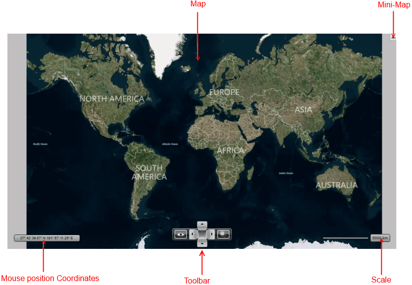
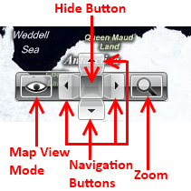

# Visual Structure

__RadMap__ is a visual control that allows you to visualize rich geographical information, to zoom and to pan smoothly to any corner of the earth.        

This section defines the terms and concepts used in the scope of the __RadMap__ that you have to get familiar with prior to continue reading this help. They can also be helpful when contacting with the support service in order to describe your issue better. Below you can see snapshots and explanations of the main states and visual elements of the standard __RadMap__ control.

* __Map__ - represents the map that comes from the Map Provider.            

* __Mini-Map__ - represents the UI controls which allow the user to navigate using map viewport.            

* __Mouse Position Coordinates__ - displays the current mouse position on the map.            

* __Toolbar__- represents the UI controls which allow the user to zoom, navigate and change the view.            

* __Scale__ - represents the scale for the current map zoom level.            

Here is a more detailed visual structure of the __Commands Bar__:

* __Hide Button__ - hides the __Toolbar__ upon clicking.            

* __Navigation Buttons__ - allow the user to pan up/down and left/right.            

* __Map View Mode__ - allows the user to change the view mode of the map (aerial, road, bird-eye).            

* __Zoom__ - allows the user to zoom in and out.            

# See Also
 * [Getting Started]()
 * [Template Structure]()
 * [Navigation]()
 * [Mouse Location]()
 * [Default Layout]()
 * [Distance and Scale]()