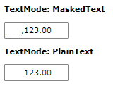
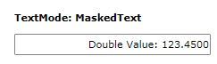
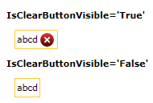

# Common

This article lists features that are common between the __RadMaskedInput__ controls.

* [No-Mask Functionality](#no-mask-functionality)
* [Input Behavior](#input-behavior)
* [Text and TextMode](#text-and-textmode-properties)
* [ValueToTextConverter](#valuetotextconverter)
* [Add/Remove the ClearButton](#addremove-the-clearbutton)
* [IsLastPositionEditable](#islastpositioneditable)
* [TextBoxStyle](#textboxstyle)

## No-Mask Functionality

You can take advantage of the 'no-mask' functionality of the __RadMaskedTextInput,RadMaskedNumericInput__ and the __RadMaskedCurrenyInput__ controls by setting the __Mask__ property to __""__ like so:		

#### __[XAML] Example 1: Setting no-mask functionality__
{{region xaml-radmaskedinput-features-common_0}}
	<telerik:RadMaskedTextInput  Mask=""/>
	<telerik:RadMaskedCurrencyInput  Mask=""/>
	<telerik:RadMaskedDateTimeInput  Mask=""/>
	<telerik:RadMaskedNumericInput Mask=""/>
{{endregion}}

This feature creates __RadMaskedInput__ controls that allow unlimited input. And as the __Mask__ property is empty, the controls won't expect a certain number of characters and this is why they will automatically update to fit the user input.	  

>tip The 'no-mask' functionality will remove the restrictions usually applied by the __Mask__ property on the type and the number of input characters in each of the controls. Still you can set the __FormatString__ property to control the input in the __RadMaskedInput__ controls when they don't specify a __Mask__. For example you can use the [Standard Numeric Format Strings](http://msdn.microsoft.com/en-us/library/dwhawy9k.aspx) and [Custom Numeric Format Strings](http://msdn.microsoft.com/en-us/library/0c899ak8.aspx) to control the input in the __RadMaskedNumericInput__ and the __RadMaskedCurrencyInput__. This means that if you need to restrict the number of digits after the decimal point to 2 in a __RadMaskedNumericInput__, you can set its __FormatString__ property to __"n2"__:    `<telerik:RadMaskedNumericInput Mask="" FormatString="n2"/>`

## Input Behavior

The __RadMaskedInput__ controls allow you to specify the characters input behavior using the __InputBehavior__ property. The property is an enumeration of type __InputBehavior__ and exposes the following values:		

* __Replace__: Inputs characters on the right of the current caret position.

* __Insert__: Inserts characters before the caret's current position for as long as there are empty positions to fill. When there are no empty positions to fill on left of the caret, then the characters are added on right of the caret.		  

>You can change the __InputBehavior__ using the __Insert__ key. Also please keep in mind that the __InputBehavior__ reflects the behavior of the __Backspace__ and __Delete__ keys		  

## Text and TextMode properties

The __RadMaskedInput__ controls expose a __Text__ property that gets the value displayed in the control when it isn't focused. The value of this property depends on the __TextMode__ enumeration, that exposed the following values:		

* __MaskedText__: When this mode is enabled the __Text__ property value represents the formatted __Value__ including the placeholder characters.		  

* __PlainText__: When this mode is enabled the __Text__ property value represents the formatted __Value__ without the placeholder characters.

#### __[XAML] Example 2: Setting TextMode property in XAML__
{{region xaml-radmaskedinput-features-common_1}}
	<StackPanel HorizontalAlignment="Center" VerticalAlignment="Center">
		<TextBlock Margin="10, 10, 10, 0" 
				   FontWeight="Bold"
				   Text="TextMode: MaskedText" />
		<telerik:RadMaskedNumericInput Margin="10, 10, 10, 0" 
									   Mask="#6.2"
									   TextMode="MaskedText"
									   Value="123" />
		<TextBlock Margin="10, 10, 10, 0" 
				   FontWeight="Bold"
				   Text="TextMode: PlainText" />
		<telerik:RadMaskedNumericInput Margin="10, 10, 10, 0" 
									   Mask="#6.2"
									   TextMode="PlainText"
									   Value="123" />
	</StackPanel>
{{endregion}}

## ValueToTextConverter

The __RadMaskedInput__ controls allow you to set an __IValueConverter__ to change the __Text__ property depending on the __Value__. The following example will illustrate a sample implementation of the ValueToTextConverter property.		

Let's start by defining an __IValueConverter__:		

#### __[C#] Example 3: Implementing IValueConverter interface__
{{region cs-radmaskedinput-features-common_2}}
	public class NumericValueToTextConverter : IValueConverter
	{
		public object Convert(object value, Type targetType, object parameter, System.Globalization.CultureInfo culture)
		{
			if (value != null)
			{
				double doubleValue = 0d;
				decimal decimalValue = 0m;
				if (double.TryParse(value.ToString(), System.Globalization.NumberStyles.Number, culture, out doubleValue))
				{
					return "Double Value: " + doubleValue.ToString("n4");
				}
				else if (decimal.TryParse(value.ToString(), System.Globalization.NumberStyles.Any, culture, out decimalValue))
				{
					return "Decimal Value: " + decimalValue.ToString("c4");
				}
				else return value.ToString();
			}
			else
			{
				return value;
			}
		}
		public object ConvertBack(object value, Type targetType, object parameter, System.Globalization.CultureInfo culture)
		{
			throw new NotImplementedException();
		}
	}
{{endregion}}

#### __[VB.NET] Example 4: Implementing IValueConverter interface__
{{region vb-radmaskedinput-features-common_3}}
	Public Class NumericValueToTextConverter
		Implements IValueConverter
		Public Function Convert(value As Object, targetType As Type, parameter As Object, culture As System.Globalization.CultureInfo) As Object Implements IValueConverter.Convert
			If value IsNot Nothing Then
				Dim doubleValue As Double = 0.0
				Dim decimalValue As Decimal = 0D
				If Double.TryParse(value.ToString(), System.Globalization.NumberStyles.Number, culture, doubleValue) Then
					Return "Double Value: " & doubleValue.ToString("n4")
				ElseIf Decimal.TryParse(value.ToString(), System.Globalization.NumberStyles.Any, culture, decimalValue) Then
					Return "Decimal Value: " & decimalValue.ToString("c4")
				Else
					Return value.ToString()
				End If
			Else
				Return value
			End If
		End Function
		Public Function ConvertBack(value As Object, targetType As Type, parameter As Object, culture As System.Globalization.CultureInfo) As Object Implements IValueConverter.ConvertBack
			Return value
			'Throw New NotImplementedException()
		End Function
	End Class
{{endregion}}

Now we can define the __NumericValueToTextConverter__ as a resource in our application and apply it to the __RadMaskedNumericInput__ properties.		

#### __[XAML] Example 5: Setting the IValueConverter to the ValueToTextConverter property in XAML__
{{region xaml-radmaskedinput-features-common_4}}
	<StackPanel HorizontalAlignment="Center" VerticalAlignment="Center">
		<StackPanel.Resources>
		  <local:NumericValueToTextConverter x:Key="numericValueToTextConverter" />  
		</StackPanel.Resources>
		<telerik:RadMaskedNumericInput Grid.Row="0" 
									   Width="220"
									   Margin="10, 10, 10, 0"
									   IsClearButtonVisible="False"
									   TextMode="PlainText"
									   ValueToTextConverter="{StaticResource numericValueToTextConverter}"
									   Value="123.45" />
	</StackPanel>
{{endregion}}

## Add/Remove the ClearButton

The default __Template__ of the __RadMaskedInput__ controls defines a __ClearButton__ that allows the user to clear the input. You can hide this button by setting the __IsClearButtonVisible__ property to __False__.

#### __[XAML] Example 6: Setting the IsClearButtonVisible property__
{{region xaml-radmaskedinput-features-common_5}}
	<StackPanel HorizontalAlignment="Center" VerticalAlignment="Center">
		<TextBlock FontWeight="Bold" Text="IsClearButtonVisible='True'" />
		<telerik:RadMaskedTextInput Margin="10" 
									Mask="llll"
									Value="abcd" />
		<TextBlock FontWeight="Bold" Text="IsClearButtonVisible='False'" />
		<telerik:RadMaskedTextInput Margin="10" 
									IsClearButtonVisible="False"
									Mask="llll"
									Value="abcd" />
	</StackPanel>
{{endregion}}

## IsLastPositionEditable

The __IsLastPositionEditable__ property indicates whether the last position in the __RadMaskedInput__ controls can be modified or not. If the property is set to __True__, the user will be able to edit the value in the last available position of the control. This is the default behavior of the __RadMaskedInput__ controls. However, if you need to restrict the user from changing this value, you can set the __IsLastPositionEditable__ property to __False__.		

## TextBoxStyle

The __RadMaskedInput__ controls have a `TextBoxStyle` property which allows you to modify the style of the underlying text box element representing the input. The property is of type `Style` which targets `PreviewInputTextBox`.

#### __[XAML] Example 7: Setting TextBoxStyle__
{{region xaml-radmaskedinput-features-common_6}}
	<telerik:RadMaskedTextInput>
 		   <!-- This ResourceDictionary is not required if you use the NoXaml version of the Telerik dlls -->
      		   <!-- It is used to access the MaskedInputTextBoxStyle resource used with the BasedOn setting -->
	     	   <!-- You can consider moving the ResourceDictionary to a parent element's Resources, like Window.Resources or UserControl.Resources  -->
 		   <telerik:RadMaskedTextInput.Resources>
			<!-- The .xaml file here will vary based on the used Telerik theme. For example, if you use Windows 11, the file should be GenericWindows11.xaml. For VisualStudio2019, GenericVisualStudio2019.xaml -->
		       <ResourceDictionary Source="/Telerik.Windows.Controls.Input;component/Themes/GenericOffice2019.xaml" />
		   </telerik:RadMaskedTextInput.Resources>
		<telerik:RadMaskedTextInput.TextBoxStyle>
  			<!-- The "maskedInput" namespace points to: -->
     			<!-- xmlns:maskedInput="clr-namespace:Telerik.Windows.Controls.MaskedInput;assembly=Telerik.Windows.Controls.Input" -->
			
		</telerik:RadMaskedTextInput.TextBoxStyle>
	</telerik:RadMaskedTextInput>
{{endregion}}

## See Also
 * [MaskedNumericInput]()
 * [MaskedCurrencyInput]()
 * [MaskedTextInput]()
 * [MaskedDateTimeInput]()
 * [Mask Tokens]()
