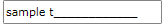
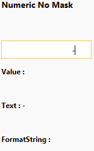

# MaskedInputExtensions

The __MaskedInputExtensions__ class allows you to further customize the __MaskedInput__ controls controlled input.

* [Control the Minimum and Maximum value](#control-the-minimum-and-maximum-value)
* [Control the Minimum and Maximum length of RadMaskedTextInput](#control-the-minimum-and-maximum-length-of-radmaskedtextinput)
* [Use the culture settings to configure the number of digits after the decimal symbol](#use-the-culture-settings-to-configure-the-number-of-digits-after-the-decimal-symbol)
* [Define the SelectionStart when the sign of the value is changed](#define-the-selectionstart-when-the-sign-of-the-value-is-changed)
* [Allow minus sign on zero value](#allow-minus-sign-on-zero-value)
* [Allow minus on null values](#allow-minus-on-null-values)
* [Tab navigation](#tab-navigation)
* [Set the caret position of RadMaskedTextInput](#set-the-caret-position-of-radmaskedtextinput)
* [Allow Null Values](#allow-null-values)

>The MaskedInputExtensions class can be accessed in XAML through the following namespace:  
>`xmlns:maskedInput="clr-namespace:Telerik.Windows.Controls.MaskedInput;assembly=Telerik.Windows.Controls.Input"`

## Control the Minimum and Maximum Value

* The __MaskedInputExtensions.Maximum__ property allows you to define the maximum value that can be entered in the __RadMaskedNumericInput__ and __RadMaskedCurrencyInput__ controls.            

	__Example 1: Setting MaskedInputExtensions.Maximum attached property__
	```XAML
		<telerik:RadMaskedNumericInput maskedInput:MaskedInputExtensions.Maximum="1000" />
	```

* The __MaskedInputExtensions.Minimum__ property allows you to define the minimum value that can be entered in the __RadMaskedNumericInput__ and __RadMaskedCurrencyInput__ controls. You can use it to restrict the user input to positive numbers only.            

	__Example 2: Setting MaskedInputExtensions.Minimum attached property__
	```XAML
		<telerik:RadMaskedNumericInput maskedInput:MaskedInputExtensions.Minimum="0" />
	```

## Control the Minimum and Maximum Length of RadMaskedTextInput

* The __MaskedInputExtensions.MaxTextLength__ property allows you to define the maximum length of the input entered in the __RadMaskedTextInput__ control.            

	__Example 3: Setting MaskedInputExtensions.MaxTextLength attached property__
	```XAML
		<telerik:RadMaskedTextInput HorizontalAlignment="Center"
									VerticalAlignment="Top"
									maskedInput:MaskedInputExtensions.MaxTextLength="8"
									Value="sample text" />
	```

	#### __Figure 1: MaskedInputExtensions.MaxTextLength attached property example__  
	

* The __MaskedInputExtensions.MinTextLength__ property allows you to define the minimum length of the input entered in the __RadMaskedTextInput__ control.            

	__Example 4: Setting MaskedInputExtensions.MinTextLength attached property__
	```XAML
		<telerik:RadMaskedTextInput HorizontalAlignment="Center"
									VerticalAlignment="Top"
									maskedInput:MaskedInputExtensions.MinTextLength="3"
									Value="sample text" />

	```

## Use the Culture Settings to Configure the Number of Digits After the Decimal Symbol

The __MaskedInputExtensions.UseCultureDigits__ property allows you to configure the __RadMaskedNumericInput__ and __RadMaskedCurrencyInput__ controls whether to use the __Culture__ settings to define the number of digits that should be displayed after the decimal symbol.        

If you set the __MaskedInputExtensions.UseCultureDigits__ property to __True__, the number of digits displayed after the decimal symbol will depend on the culture settings.        

__Example 5: Setting MaskedInputExtensions.UseCultureDigits attached property__
```XAML
	  <telerik:RadMaskedNumericInput maskedInput:MaskedInputExtensions.UseCultureDigits="True" />
```

>Please keep in mind that when you set the __RadMaskedInputExtensions.UseCultureDigits__ property to __True__, if you want to define a __Mask__ for the control, it has to be set after the __.UseCultureDigits__ property in the definition of the __RadMaskedInput__ control.          

## Define the SelectionStart When the Sign of the Value is Changed

When you change the sign of a value entered in the __RadMaskedNumericInput__ and/or the __RadMaskedCurrencyInput__ control you may need to move the cursor at the beginning of the control. You can implement such a scenario using the  __RadMaskedInputExtensions.SelectionStartOnSignChanged__ property.        

It is an enumeration of type __SelectionStartOnSignChanged__ that exposes the following values:        

* __Beginning__ - when the sign of the value is changed, the caret is moved at the beggining of the control.            

* __Unchanged__ - when the sign of the value is changed, the caret isn't moved. This is the default behavior of the __RadMaskedNumericInput__ and __RadMaskedCurrencyInput__ controls.            

__Example 6: Setting MaskedInputExtensions.SelectionStartOnSignChanged attached property__
```XAML
	<StackPanel Background="White">
		<telerik:RadMaskedNumericInput maskedInput:MaskedInputExtensions.SelectionStartOnSignChanged="Beginning" />
		<telerik:RadMaskedNumericInput maskedInput:MaskedInputExtensions.SelectionStartOnSignChanged="Unchanged" />
	</StackPanel>
```

## Allow Minus Sign on Zero Value

The __RadMaskedInputExtensions__ expose an __AllowMinusOnZeroValues__ attached property. It controls whether the minus sign ("-") in front of the zero (0 or 0.0) value can be visualized. If you set it to __False__, users will not be allowed to enter minus when the Value property of the control equals zero. 

The major difference that this property makes is when you initially have a negative number entered and you change it to zero. When the __AllowMinusOnZeroValues__ is set to __False__, the minus sign will not be preserved; otherwise the minus will remain.        

>The default value of the property is __True__.          

## Allow Minus on Null Values

The __MaskedInputExtensions.AllowMinusOnNullValue__ property allows you to display the minus sign when the value of the control is set to __Null__ and you press the OemMinus/Subtract key on the keyboard. The default value of the attached property is set to __False__, which means that the described behavior is disabled by default.

__Example 7: Setting MaskedInputExtensions.AllowMinusOnNullValue attached property__
```XAML
	<telerik:RadMaskedNumericInput Mask="" maskedInput:MaskedInputExtensions.AllowMinusOnNullValue="True" />
```

> This property is designed to work only for the __RadMaskedNumericInput__ and __RadMaskedCurrencyInput__ controls with an empty mask (Mask="")

When the property is set to __True__ and the __Value__ is set to __null__, the minus symbol will be included in the Text property, however, the value will remain null. You can see the example in *Figure 2*.

#### __Figure 2: MaskedInputExtensions.AllowMinusOnNullValue attached property example__


By default, the minus sign cannot be deleted on press of the __Delete__ or the __Backspace__ key. To change this behavior, you will need to create a custom masked input class that derives from either the RadMaskedNumeric or RadMaskedCurrencyInput control and override its CanModifyChar, HandleDeleteKeyNoMask and HandleBackKeyNoMask methods. This approach is demonstrated in the [MinusKeyCustomizations](https://github.com/telerik/xaml-sdk/tree/master/MaskedInput/MinusKeyCustomizations) SDK example.

> To take full advantage of a culture-specific parsing/formatting when using no mask (Mask=""), you should also set the FormatString property. In the numeric input control use `n, n0, n1,..., etc.` and in currency input `c, c0, c1, c2,..., etc.`

## Tab Navigation

The keyboard navigation of the RadMaskedInput suite of controls can be controlled by three properties: the native __IsTabStop__, the __SectionsNavigationMode__ and the attached __IsEditorTabStop__ properties, as shown in Example 7.         

__Example 8: Setting MaskedInputExtensions.IsEditorTabStop attached property__
```XAML
	<StackPanel>
		<telerik:RadMaskedTextInput SectionsNavigationMode="None" />
		<telerik:RadMaskedTextInput IsTabStop="False"
							SectionsNavigationMode="None"
							maskedInput:MaskedInputExtensions.IsEditorTabStop="False" />
		<telerik:RadMaskedTextInput SectionsNavigationMode="None" />
	</StackPanel>
```

You can find more information about the keyboard navigation in the [Keyboard and Mouse Support]() help article.        

## Set the Caret Position in a RadMaskedTextInput

The __MaskedInputExtensions.CaretToEndOfTextOnFocus__ property allows you to configure the RadMaskedTextInput control, whether to place the caret at the beginning of the text or at the end of it, when the control has focus. If you set it to __True__, the caret will be placed at the end of the text, as shown in Example 8.

__Example 9: Setting MaskedInputExtensions.CaretToEndOfTextOnFocus attached property__
```XAML
	<telerik:RadMaskedTextInput maskedInput:MaskedInputExtensions.CaretToEndOfTextOnFocus="True"/>
```

>This property is designed to work only for the RadMaskedTextInput control.

## Allow Null Values

By default the RadMaskedNumericInput and RadMaskedCurrencyInput don't allow you to set *null* to their Value property. Instead the *null* value is coerced to *0*. To alter this behavior and allow *null* values you can set the __MaskedInputExtensions.AllowNull__ attached property to __True__.

__Example 10: Setting MaskedInputExtensions.AllowNull attached property__
```XAML
	<telerik:RadMaskedNumericInput maskedInput:MaskedInputExtensions.AllowNull="True"/>
```

>This property is designed to work only for the RadMaskedNumericInput and RadMaskedCurrencyInput controls.

## See Also
 * [Common Features]()
 * [Keyboard navigation]()
 * [MaskedNumericInput]()
 * [MaskedCurrencyInput]()
 * [MaskedTextInput]()
 * [MaskedDateTimeInput]()
