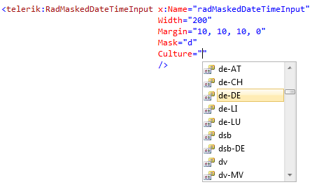
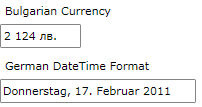

# Globalization Support

The __RadMaskedInput__ controls provide full globalization support out-of-the-box through the __Culture__ property.

#### __Figure 1: Full globalization support__ 

The next example declares a __RadMaskedCurrencyInput__ and a __RadMaskedDateTimeInput__ controls. The first one is used for entering Bulgarian currency - the culture is set to bg-BG. The second one is used for entering __DateTime__ data and also the culture is changed to de-DE.

#### __[XAML] Example 1: Setting the Culture property__
{{region xaml-radmaskedinput-features-globalization_0}}
	<Grid x:Name="LayoutRoot" Background="White">
	    <StackPanel>
	        <TextBlock Margin="5 0" Text="Bulgarian Currency" />
	        <telerik:RadMaskedCurrencyInput Margin="0,5,0,10" 
	                                        Culture="bg-BG"
	                                        Mask="c4" />
	        <TextBlock Margin="5 0" Text="German DateTime Format" />
	        <telerik:RadMaskedDateTimeInput Margin="0,5,0,10" 
	                                        Culture="de-DE"
	                                        Mask="D" />
	    </StackPanel>
	</Grid>
{{endregion}}

## See Also
 * [Getting Started]()
 * [Common Features]()