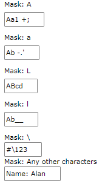
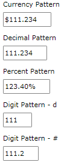
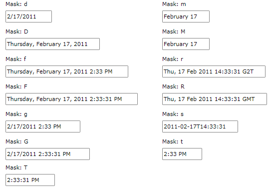
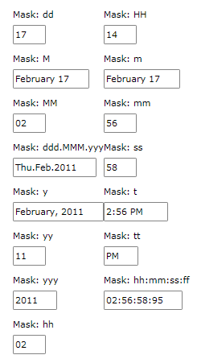
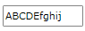

# Mask Tokens

The __RadMaskedInput__ controls expose a __Mask__ property to allow you to further restrict the user's input accordingly to the __MaskedInput__ control definition. Bellow you can find a list with some of the most commonly used Mask tokens.	  

## Alphanumeric tokens

### 1. Standard format codes:

* __A__: Alphanumeric or a special character, required.		  

* __a__: Alphanumeric or a special character, not required 

* __L__: Letter, required. Restrict input to the ASCII letters a-z and A-Z. This mask element is equivalent to [a-zA-Z] in regular expressions.			  

* __l__: Letter, not required			  

* __\\__: Escapes a mask character, turning it into a literal. "\\" is the escape sequence for a backslash.			  

* __Any other characters__: (literals) All non-mask elements will appear as themselves within __RadMaskedTextInput__. Literals always occupy a static position in the mask at run time, and cannot be moved or deleted by the user.			  

__Example 1: Setting standard format codes__
```XAML
	<StackPanel HorizontalAlignment="Center" VerticalAlignment="Center">
	    <TextBlock Text="Mask: A" />
	    <telerik:RadMaskedTextInput Margin="0,5,0,10" Mask="AAAAAA" />
	    <TextBlock Text="Mask: a" />
	    <telerik:RadMaskedTextInput Margin="0,5,0,10" Mask="aaaaaa" />
	    <TextBlock Text="Mask: L" />
	    <telerik:RadMaskedTextInput Margin="0,5,0,10" Mask="LLLL" />
	    <TextBlock Text="Mask: l" />
	    <telerik:RadMaskedTextInput Margin="0,5,0,10" Mask="llll" />
	    <TextBlock Text="Mask: \" />
	    <telerik:RadMaskedTextInput Mask="\#\\###" />
	    <TextBlock Text="Mask: Any other characters" />
	    <telerik:RadMaskedTextInput Mask="N\ame: llll" />
	</StackPanel>
```



### 2. Numeric format codes:

* __c__: Currency pattern, not required			  

* __n__: Decimal pattern, required			  

* __p__: Percentage, not required			  

* __d__: Digit pattern, required			  

* __#__: Digit pattern, not required. If this position is blank in the mask, it will be rendered as the character in the Placeholder property. Plus (+) and minus (-) signs are allowed.			  

__Example 2: Setting numeric format codes__
```XAML
	<StackPanel HorizontalAlignment="Center" VerticalAlignment="Center">
	    <TextBlock Text="Currency Pattern" />
	    <telerik:RadMaskedCurrencyInput Margin="0,5,0,10" 
	                                    Mask="c3.3"
	                                    Value="111.234" />
	    <TextBlock Text="Decimal Pattern" />
	    <telerik:RadMaskedNumericInput Margin="0,5,0,10" 
	                                    Mask="n3.3"
	                                    Value="111.234" />
	    <TextBlock Text="Percent Pattern" />
	    <telerik:RadMaskedNumericInput Margin="0,5,0,10" 
	                                    Mask="p3.2"
	                                    Value="111.234" />
	    <TextBlock Text="Digit Pattern - d" />
	    <telerik:RadMaskedNumericInput Margin="0,5,0,10" 
	                                    Mask="d3"
	                                    Value="111.234" />
	    <TextBlock Text="Digit Pattern - #" />
	    <telerik:RadMaskedNumericInput Margin="0,5,0,10" 
	                                    Mask="#3.1"
	                                    Value="111.234" />
	</StackPanel>
```



>An explanation about the default numeric format strings can be found in this [MSDN article](https://docs.microsoft.com/en-us/dotnet/standard/base-types/standard-numeric-format-strings).

## DateTime Tokens

### 1. Standard DateTime Format Codes

* __d__: Short date pattern.			  

* __D__: Long date pattern.			  

* __f__: Full date and time (long date and short time).			  

* __F__: Full date time pattern (long date and long time).			  

* __g__: General (short date and short time).			  

* __G__: General (short date and long time).			  

* __m, M__: Month day pattern.			  

* __r, R__: RFC1123 pattern.			  

* __s__: Sortable DateTime pattern (based on ISO 8601) using local time.			  

* __t__: Short time pattern.			  

* __T__: Long time pattern.			  

__Example 3: Using defined tokens__
```XAML
	<StackPanel HorizontalAlignment="Center" VerticalAlignment="Center">
	    <TextBlock Text="Mask: d" />
	    <telerik:RadMaskedDateTimeInput Margin="0,5,0,10" Mask="d" />
	    <TextBlock Text="Mask: D" />
	    <telerik:RadMaskedDateTimeInput Margin="0,5,0,10" Mask="D" />
	    <TextBlock Text="Mask: f" />
	    <telerik:RadMaskedDateTimeInput Margin="0,5,0,10" Mask="f" />
	    <TextBlock Text="Mask: F" />
	    <telerik:RadMaskedDateTimeInput Margin="0,5,0,10" Mask="F" />
	    <TextBlock Text="Mask: g" />
	    <telerik:RadMaskedDateTimeInput Margin="0,5,0,10" Mask="g" />
	    <TextBlock Text="Mask: G" />
	    <telerik:RadMaskedDateTimeInput Margin="0,5,0,10" Mask="G" />
	    <TextBlock Text="Mask: m" />
	    <telerik:RadMaskedDateTimeInput Margin="0,5,0,10" Mask="m" />
	    <TextBlock Text="Mask: M" />
	    <telerik:RadMaskedDateTimeInput Margin="0,5,0,10" Mask="M" />
	    <TextBlock Text="Mask: r" />
	    <telerik:RadMaskedDateTimeInput Margin="0,5,0,10" Mask="r" />
	    <TextBlock Text="Mask: R" />
	    <telerik:RadMaskedDateTimeInput Margin="0,5,0,10" Mask="R" />
	    <TextBlock Text="Mask: s" />
	    <telerik:RadMaskedDateTimeInput Margin="0,5,0,10" Mask="s" />
	    <TextBlock Text="Mask: t" />
	    <telerik:RadMaskedDateTimeInput Margin="0,5,0,10" Mask="t" />
	    <TextBlock Text="Mask: T" />
	    <telerik:RadMaskedDateTimeInput Margin="0,5,0,10" Mask="T" />
	</StackPanel>
```



>An explanation about the default DateTime format strings can be found in this [MSDN article](https://docs.microsoft.com/en-us/dotnet/standard/base-types/standard-date-and-time-format-strings).

### 2. Custom DateTime Format Codes

When standard date codes are too restrictive, you can create your own custom formats using the format patterns listed below:

* __d__: Day token			  

* __dd__: The numeric day of the month.			  

* __ddd__: The abbreviated name of the day of the week.			  

* __M__: The month name followed by the numeric day.			  

* __MM__: The numeric month.			  

* __MMM__: The abbreviated name of the month.			  

* __MMMM__: The full name of the month.			  

* __y__: The full month name and year numeric.			  

* __yy__: The year without the century.			  

* __yyyy__: The year in four digits, including the century.			  

* __h, hh__: The hour in a 12-hour clock.			  

* __H, HH__: the hour in a 24-hour clock.			  

* __ms, mm__: Minutes seconds, minutes token			  

* __s__,__ss__: Seconds token			  

* __t__: The first character in the AM/PM designator.			  

* __tt__: The AM/PM designator.			  

* __f__: Millisecond token			  

> The day time period can be changed using the keyboard arrows keys. When the caret is on the time period you can simply press __UP__ or __DOWN__ arrow keys from AM to PM and vice verse.

__Example 4: Setting custom DateTime format codes__
```XAML
	<StackPanel Background="White"
	            Orientation="Horizontal"
	            HorizontalAlignment="Center"
	            VerticalAlignment="Center">
	    <StackPanel >
	        <TextBlock Text="Mask: dd" />
	        <telerik:RadMaskedDateTimeInput Margin="0,5,0,10" Mask="dd" />
	        <TextBlock Text="Mask: M" />
	        <telerik:RadMaskedDateTimeInput Margin="0,5,0,10" Mask="M" />
	        <TextBlock Text="Mask: MM" />
	        <telerik:RadMaskedDateTimeInput Margin="0,5,0,10" Mask="MM" />
	        <TextBlock Text="Mask: ddd.MMM.yyy" />
	        <telerik:RadMaskedDateTimeInput Margin="0,5,0,10" Mask="ddd.MMM.yyy" />
	        <TextBlock Text="Mask: y" />
	        <telerik:RadMaskedDateTimeInput Margin="0,5,0,10" Mask="y" />
	        <TextBlock Text="Mask: yy" />
	        <telerik:RadMaskedDateTimeInput Margin="0,5,0,10" Mask="yy" />
	        <TextBlock Text="Mask: yyy" />
	        <telerik:RadMaskedDateTimeInput Margin="0,5,0,10" Mask="yyy" />
	        <TextBlock Text="Mask: hh" />
	        <telerik:RadMaskedDateTimeInput Margin="0,5,0,10" Mask="hh" />
	    </StackPanel>
	    <StackPanel >
	        <TextBlock Text="Mask: HH" />
	        <telerik:RadMaskedDateTimeInput Margin="0,5,0,10" Mask="HH" />
	        <TextBlock Text="Mask: m" />
	        <telerik:RadMaskedDateTimeInput Margin="0,5,0,10" Mask="m" />
	        <TextBlock Text="Mask: mm" />
	        <telerik:RadMaskedDateTimeInput Margin="0,5,0,10" Mask="mm" />
	        <TextBlock Text="Mask: ss" />
	        <telerik:RadMaskedDateTimeInput Margin="0,5,0,10" Mask="ss" />
	        <TextBlock Text="Mask: t" />
	        <telerik:RadMaskedDateTimeInput Margin="0,5,0,10" Mask="t" />
	        <TextBlock Text="Mask: tt" />
	        <telerik:RadMaskedDateTimeInput Margin="0,5,0,10" Mask="tt" />
	        <TextBlock Text="Mask: hh:mm:ss:ff" />
	        <telerik:RadMaskedDateTimeInput Margin="0,5,0,10" Mask="hh:mm:ss:ff" />
	    </StackPanel>
	</StackPanel>
```



>If you use the __yy__ mask token, you need to keep in mind that the two letter year section will represent date time objects between the years of 1929 and 2029. Basically the __RadMaskedDateTimeInput__ control uses the __Culture__ settings and specifically the __Calendar.TwoDigitYearMax__ property to distinguish the year that is entered in the control based on its last two digits. You can find more information [here](http://msdn.microsoft.com/en-us/library/system.globalization.calendar.twodigityearmax.aspx).				

## Modifier Tokens

* __>__ - To Upper token		  

* __<__ - To Lower token		  

__Example 5: Setting modifier tokens__
```XAML
	<telerik:RadMaskedTextInput Margin="0,5,0,10" Mask="&gt;a5&lt;a5" />
```

>important Please note that the  "<" and ">" must be escaped in XAML, otherwise  the Visual Studio might throw an error.		  



>When you customize a mask you should keep in mind that the Mask is basically structured like so:
> __MaskTokenN.F__
>	- __MaskToken__: MaskToken restricting the input characters
>	- __N__: Number of input characters, not required
>	- __F__: Number of input digits after the decimal point, not required			

For instance: 

__Example 6: Customize mask property__
```XAML
	<telerik:RadMaskedNumericInput Mask="#3.2" />
```

## Allow Invalid Values

In the __Mask__ scenario, the control will update its Value property only when its input passes the validation process. The validation rules are determined by the symbols set in the Mask property. Otherwise, the __ValueChanged__ event won't be triggered. To allow property change on every user input, you can set the __AllowInvalidValues__ property to True. 

__Example 7: Allow Invalid Values__
```XAML
	<telerik:RadMaskedTextInput Mask="AAAAAA" AllowInvalidValues="true" />
```
 
## See Also
 * [Common Features]()
 * [MaskedNumericInput]()
 * [MaskedCurrencyInput]()
 * [MaskedTextInput]()
 * [MaskedDateTimeInput]()
