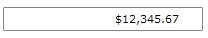
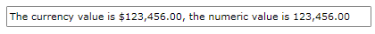

# MaskedCurrencyInput

The __RadMaskedCurrencyInput__ represents the basic control that can be used to restrict the input of currency values.				

In order to use the __RadMaskedCurrencyInput__ control in your projects you have to add references to the following assemblies:

* __Telerik.Licensing.Runtime__
* __Telerik.Windows.Controls__
* __Telerik.Windows.Controls.Input__
* __Telerik.Windows.Data__  

You can find more info [here](http://www.telerik.com/help/wpf/installation-installing-controls-dependencies-wpf.html).

>tip With the 2025 Q1 release, the Telerik UI for WPF has a new licensing mechanism. You can learn more about it [here]().

## Declaratively defined MaskedCurrencyInput

Here is a simple definition of a __RadMaskedCurrencyInput__ control:				

__Example 1: Define RadMaskedCurrencyInput in XAML__
<snippet id='radmaskedinput-features-maskedinput-controls-currency-block_1-xaml' />

You can further customize the __RadMaskedCurrencyInput__ control's behavior by setting the IsCurrencySymbolVisible property to False thus hiding the culture specific currency symbol. By default this property is set to True.

## Properties

* __Value__: A property of type __decimal?__ that gets or set the current value of the control.
* __AutoFillNumberGroupSeparators__: A boolean property that gets or sets whether number group separators are auto filled in the mask.
* __AutoFillZeros__: A boolean property that gets or sets whether trailing zeros should be auto filled.
* __AllowSkipPlaceholders__: A boolean property that gets or sets whether input can skip placeholders.
* __IsCurrencySymbolVisible__: A boolean property that gets or sets whether the currency symbol is visible or not. Default value is __True__.

## Data Binding

RadMaskedCurrencyInput's __Value__ property is of type __nullable decimal (decimal?)__ and you have to bind it to ViewModel's property of type decimal or nullable decimal (if you need to set null). 

>important Binding to __object__ is not support and may result in unpredictable behavior.

__Example 2: Define the view model__
<snippet id='radmaskedinput-features-maskedinput-controls-currency-block_2-xaml' />

__Example 3: Binding the Value property__
<snippet id='radmaskedinput-features-maskedinput-controls-currency-block_3-cs' />

## FormatString

You can further format the entered value by setting the __FormatString__ property. It uses [Standard Numeric Format Strings](http://msdn.microsoft.com/en-us/library/dwhawy9k.aspx) and [Custom Numeric 
Format Strings](http://msdn.microsoft.com/en-us/library/0c899ak8.aspx) to further format the __Text__ property.				

### FormatString with Mask

When __Mask__ property is set the __FormatString__ property will be applied to the __Text__ property of MaskedCurrencyInput control. 

__Example 4: Setting the FormatString property in Mask scenario__
<snippet id='radmaskedinput-features-maskedinput-controls-currency-block_4-xaml' />

### FormatString with No-Mask

In __No-Mask__ scenario the __FormatString__ property will be applied to the __Value__ property of MaskedNumericInput control. 

__Example 5: Setting the FormatString property__
<snippet id='radmaskedinput-features-maskedinput-controls-currency-block_5-xaml' />

## See Also
 * [Getting Started]()
 * [MaskedNumericInput]()
 * [MaskedTextInput]()
 * [MaskedDateTimeInput]()
 * [Common Features]()