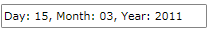

# MaskedDateTimeInput

The __RadMaskedDateTimeInput__ represents the basic control that can be used to restrict the input of DateTime values.


>In order to use the __RadMaskedDateTimeInput__ control in your projects you have to add references to the following assemblies:
>	- __Telerik.Windows.Controls__
>	- __Telerik.Windows.Controls.Input__  

>You can find more info [here](http://www.telerik.com/help/silverlight/installation-installing-controls-dependencies.html).


 
>In order to use the __RadMaskedDateTimeInput__ control in your projects you have to add references to the following assemblies:
>	- __Telerik.Windows.Controls__
>	- __Telerik.Windows.Controls.Input__
>	- __Telerik.Windows.Data__  

>You can find more info [here](http://www.telerik.com/help/wpf/installation-installing-controls-dependencies-wpf.html).


Here is a simple definition of a __RadMaskedDateTimeInput__ control:

#### __XAML__
{{region radmaskedinput-features-controls-datetime_0}}
	<telerik:RadMaskedDateTimeInput x:Name="radMaskedDateTimeInput" 
	                                Width="200"
	                                Margin="20 20 20 10"
	                                Culture="en-US"
	                                EmptyContent="Enter digits"
	                                InputBehavior="Replace"
	                                Mask="dd-MM-yyyy"
	                                SelectionOnFocus="SelectAll"
	                                TextMode="PlainText"
	                                UpdateValueEvent="LostFocus" />
{{endregion}}

You can further restrict the user input by setting the __FormatString__ property.

#### __XAML__
{{region radmaskedinput-features-controls-datetime_1}}
	<telerik:RadMaskedDateTimeInput x:Name="radMaskedDateTimeInput"                       
	                                HorizontalAlignment="Center"
	                                Culture="en-US"
	                                FormatString="{}Day: {0:dd}, Month: {0:MM}, Year: {0:yyyy}"
	                                InputBehavior="Replace"
	                                Mask="dd-MM-yyyy"
	                                SelectionOnFocus="SelectAll"
	                                TextMode="PlainText"
	                                UpdateValueEvent="LostFocus" />
{{endregion}}

# See Also
 * [Getting Started]()
 * [MaskedNumericInput]()
 * [MaskedCurrencyInput]()
 * [MaskedTextInput]()
 * [Common Features]()