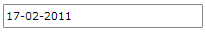

# MaskedDateTimeInput

The `RadMaskedDateTimeInput`` represents the basic control that can be used to restrict the input of DateTime values.

In order to use the RadMaskedDateTimeInput control in your projects you have to add references to the following assemblies:

* __Telerik.Licensing.Runtime__
* __Telerik.Windows.Controls__
* __Telerik.Windows.Controls.Input__
* __Telerik.Windows.Data__  

You can find more info [here](http://www.telerik.com/help/wpf/installation-installing-controls-dependencies-wpf.html).

>tip With the 2025 Q1 release, the Telerik UI for WPF has a new licensing mechanism. You can learn more about it [here]().

## Declaratively defined MaskedDateTimeInput

Here is a simple definition of a RadMaskedDateTimeInput control:

#### __[XAML] Define RadMaskedDateTimeInput in XAML__
{{region xaml-radmaskedinput-features-controls-datetime_0}}
	<telerik:RadMaskedDateTimeInput Width="200"
	                                Margin="20 20 20 10"
	                                Culture="en-US"
	                                EmptyContent="Enter digits"
	                                InputBehavior="Replace"
	                                Mask="dd-MM-yyyy"
	                                SelectionOnFocus="SelectAll"
	                                TextMode="PlainText"
	                                UpdateValueEvent="LostFocus" />
{{endregion}}

## Data Binding

RadMaskedDateTimeInput's `Value` property is of type `DateTime` and you can bind it to view model's property of type DateTime. 

>important Binding to the __object__ type is not supported and may result in unpredictable behavior.

#### __[XAML] Define the view model__
{{region radmaskedinput-features-controls-datetime_1}}
	public class ViewModel : ViewModelBase
	{
		private DateTime startDate;

		public ViewModel()
		{
			this.StartDate = DateTime.Now;
		}

		public DateTime StartDate
		{
			get { return this.startDate; }
			set
			{
				if (this.startDate != value)
				{
					this.startDate = value;
					this.OnPropertyChanged("StartDate");
				}
			}
		}
	}
{{endregion}}

#### __[C#] Binding the Value property__
{{region radmaskedinput-features-controls-datetime_2}}
	<telerik:RadMaskedDateTimeInput Width="200" x:Name="dateTime"
	                        	Margin="20 20 20 10"
	                        	Culture="en-US"
	                        	EmptyContent="Enter digits"
	                        	InputBehavior="Replace"
	                        	Mask="dd-MM-yyyy"
	                        	SelectionOnFocus="SelectAll"
	                        	TextMode="PlainText"                                    
	                        	UpdateValueEvent="LostFocus"
                            		Value="{Binding StartDate}"/>
{{endregion}}

## Change AM/PM

With the built-in functionality of the control it is not necessary to type __AM__ or __PM__ in order to change the time period. When the caret is on the time period you can simply press __UP__ or __DOWN__ arrow keys from AM to PM and vice verse. In order to display the time period simply add "t" or "tt" in the Mask property.

#### __[C#] Binding the Value property__
{{region radmaskedinput-features-controls-datetime_2}}
	<telerik:RadMaskedDateTimeInput HorizontalAlignment="Center" 
	                                Culture="en-US"
	                                FormatString="{}Day: {0:dd}, Month: {0:MM}, Year: {0:yyyy}, {0:tt}"
	                                InputBehavior="Replace"
	                                Mask="dd-MM-yyyy tt"
	                                SelectionOnFocus="SelectAll"
	                                TextMode="PlainText"
	                                UpdateValueEvent="LostFocus" />
{{endregion}}

__Showing the time period__

 

## FormatString

You can further format the entered value by setting the `FormatString` property.

#### __[XAML] Setting the FormatString property__
{{region xaml-radmaskedinput-features-controls-datetime_3}}
	<telerik:RadMaskedDateTimeInput HorizontalAlignment="Center"
                                	VerticalAlignment="Center"
                            		Culture="en-US"
                            		FormatString="{}Day: {0:dd}, Month: {0:MM}, Year: {0:yyyy}"
                            		InputBehavior="Replace"
                            		Mask="dd-MM-yyyy"
                            		SelectionOnFocus="SelectAll"
                            		TextMode="PlainText"
                            		UpdateValueEvent="LostFocus" />
{{endregion}}

__Showing the text value when the control is focused__

__Showing the text value when the control is unfocused__

## See Also
 * [Getting Started]()
 * [MaskedNumericInput]()
 * [MaskedCurrencyInput]()
 * [MaskedTextInput]()
 * [Common Features]()
