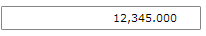

# MaskedNumericInput

The __RadMaskedNumericInput__ represents the basic control that can be used to restrict numeric user input.


>In order to use the __RadMaskedNumericInput__ control in your projects you have to add references to the following assemblies:
>	- __Telerik.Windows.Controls__
>	- __Telerik.Windows.Controls.Input__  

>You can find more info [here](http://www.telerik.com/help/silverlight/installation-installing-controls-dependencies.html).


 
>In order to use the __RadMaskedNumericInput__ control in your projects you have to add references to the following assemblies:
>	- __Telerik.Windows.Controls__
>	- __Telerik.Windows.Controls.Input__
>	- __Telerik.Windows.Data__  

>You can find more info [here](http://www.telerik.com/help/wpf/installation-installing-controls-dependencies-wpf.html).


Here is a simple definition of a __RadMaskedNumericInput__ control:

#### __XAML__
{{region radmaskedinput-features-controls-numeric_0}}
    <telerik:RadMaskedNumericInput x:Name="radMaskedNumericInput" 
                                   HorizontalAlignment="Center"
                                   Culture="en-US"
                                   EmptyContent="Enter digits"
                                   InputBehavior="Replace"
                                   Mask="#9.2"
                                   SelectionOnFocus="SelectAll"
                                   TextMode="PlainText"
                                   UpdateValueEvent="LostFocus"
                                   Value="12345" />
{{endregion}}

You can further restrict the user input by setting the __FormatString__ property. It uses [Standard Numeric Format Strings](http://msdn.microsoft.com/en-us/library/dwhawy9k.aspx) and [Custom Numeric Format Strings](http://msdn.microsoft.com/en-us/library/0c899ak8.aspx) to further format the __Text__ property.

#### __XAML__
{{region radmaskedinput-features-controls-numeric_1}}
    <telerik:RadMaskedNumericInput x:Name="radMaskedNumericInput" 
                                   Width="200"
                                   Margin="20 20 20 10"
                                   Culture="en-US"
                                   EmptyContent="Enter digits"
                                   FormatString="n3"
                                   InputBehavior="Replace"
                                   Mask="#9.2"
                                   SelectionOnFocus="SelectAll"
                                   TextMode="PlainText"
                                   UpdateValueEvent="LostFocus"
                                   Value="12345" />
{{endregion}}

# See Also
 * [Getting Started]()
 * [MaskedCurrencyInput]()
 * [MaskedTextInput]()
 * [MaskedDateTimeInput]()
 * [Common Features]()