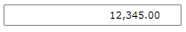

# MaskedNumericInput

The __RadMaskedNumericInput__ represents the basic control that can be used to restrict numeric user input.

In order to use the __RadMaskedNumericInput__ control in your projects you have to add references to the following assemblies:

* __Telerik.Licensing.Runtime__
* __Telerik.Windows.Controls__
* __Telerik.Windows.Controls.Input__
* __Telerik.Windows.Data__  

You can find more info [here](http://www.telerik.com/help/wpf/installation-installing-controls-dependencies-wpf.html).

>tip With the 2025 Q1 release, the Telerik UI for WPF has a new licensing mechanism. You can learn more about it [here]().

## Declaratively defined MaskedNumericInput

Here is a simple definition of a __RadMaskedNumericInput__ control:

__Example 1: Define RadMaskedNumericInput in XAML__
<snippet id='radmaskedinput-features-maskedinput-controls-numeric-block_1-xaml' />

## Data Binding

RadMaskedNumericInput's __Value__ property is of type __nullable double (double?)__ and you have to bind it to ViewModel's property of type double or nullable double (if you need to set null). 

>important Binding to __object__ is not support and may result in unpredictable behavior.

__Example 2: Define the view model__
<snippet id='radmaskedinput-features-maskedinput-controls-numeric-block_2-xaml' />

__Example 3: Binding the Value property__
<snippet id='radmaskedinput-features-maskedinput-controls-numeric-block_3-cs' />

## FormatString property

You can further format the entered value by setting the __FormatString__ property. It uses [Standard Numeric Format Strings](http://msdn.microsoft.com/en-us/library/dwhawy9k.aspx) and [Custom Numeric Format Strings](http://msdn.microsoft.com/en-us/library/0c899ak8.aspx) to further format the __Text__ property.

### In Mask scenario

When __Mask__ property is set the __FormatString__ property will be applied to the __Text__ property of MaskedNumericInput control. 

__Example 2: Setting the FormatString property in Mask scenario__
<snippet id='radmaskedinput-features-maskedinput-controls-numeric-block_4-xaml' />

### In No-Mask scenario

In __No-Mask__ scenario the __FormatString__ property will be applied to the __Value__ property of MaskedNumericInput control. 

__Example 3: Setting the FormatString property in No-Mask scenario__
<snippet id='radmaskedinput-features-maskedinput-controls-numeric-block_5-xaml' />

## See Also
 * [Getting Started]()
 * [Masked Input Extensions] ()
 * [Common Features]()
 * [MaskedCurrencyInput]()
 * [MaskedTextInput]()
 * [MaskedDateTimeInput]() 