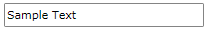
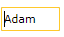
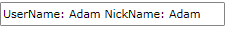

# MaskedTextInput

`RadMaskedTextInput` represents a control that can be used to restrict the input of text values.

To use the RadMaskedTextInput control in your projects, add references to the following assemblies:

* __Telerik.Licensing.Runtime__
* __Telerik.Windows.Controls__
* __Telerik.Windows.Controls.Input__
* __Telerik.Windows.Data__  

You can find more info [here](http://www.telerik.com/help/wpf/installation-installing-controls-dependencies-wpf.html).

>tip With the 2025 Q1 release, the Telerik UI for WPF has a new licensing mechanism. You can learn more about it [here]().

## Declaratively defined MaskedTextInput

The following example shows how to define the control and set few of its properties.

__Define RadMaskedTextInput in XAML__
<snippet id='radmaskedinput-features-maskedinput-controls-text-block_1-xaml' />

__RadMaskedTextInput example__

## Data Binding

RadMaskedTextInput's `Value` property is of type __string__ and you have to bind it to ViewModel's property of type __string__. 

>important Binding to __object__ is not support and may result in unpredictable behavior.

__Define the view model__
<snippet id='radmaskedinput-features-maskedinput-controls-text-block_2-xaml' />

__Binding the Value property__
<snippet id='radmaskedinput-features-maskedinput-controls-text-block_3-cs' />

## Setting the Value Mode

The value mode allows you to set the behavior of the Value property in a mask scenario (when the Mask property is set). By default the Value property holds the characters without including the placeholders and the literals defined in the mask. You can alter this and allow the value to hold also literal and placeholders by setting the `ValueMode` property of the control.

Read more about this in the [Value Mode]() article.

## FormatString

You can format the entered value using the `FormatString` property of the RadMaskedTextInput control. The property works with the standard .NET string formats. The format will be applied only when the control is unfocused.

__Setting the FormatString property__
<snippet id='radmaskedinput-features-maskedinput-controls-text-block_4-xaml' />

__Showing the text value when the control is focused__

__Showing the text value when the control is unfocused__

## Accepts Return

The `RadMaskedTextInput` control allows you to span the input text on multiple lines. This is controlled via the `AcceptsReturn` property and its default value is __True__. To disable the text to be inputted on multiple lines, set the AcceptsReturn property to __False__.

__Disable multi-line text input__
<snippet id='radmaskedinput-features-maskedinput-controls-text-block_5-xaml' />

## See Also
 * [Getting Started]()
 * [MaskedNumericInput]()
 * [MaskedCurrencyInput]()
 * [MaskedDateTimeInput]()
 * [Common Features]()