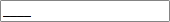
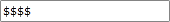

# Placeholder

The __Placeholder__ character is a character used to represent the absence of user input in a __RadMaskedInput__ control. The default value is an underscore. The __Placeholder__ character will be displayed in a __RadMaskedInput__ control for any mask position that the user has not filled in yet.

#### __[XAML] Example 1: Using the default placeholder__
{{region xaml-radmaskedinput-features-placeholder_0}}
	<telerik:RadMaskedTextInput Mask="####" />
{{endregion}}

#### __Figure 1 : Default placeholder__

When the __Value__ of a __RadMaskedInput__ control contains underscore character, it will be removed when we use the default placeholder. This is because of the default placeholder of the control is underscore character __"_"__. You can alter this behavior by changing the default __Placeholder__. In order to do that you can set a __RadMaskedInput__ control's __Placeholder__ property, like in __Example 1__.

#### __[XAML] Example 1: Change the default placeholder__
{{region xaml-radmaskedinput-features-placeholder_1}}
	<telerik:RadMaskedTextInput Mask="####" Placeholder="$" />
{{endregion}}

#### __Figure 2: Custom placeholder__

>tip You can set a watermark content to the __RadMaskedInput__ controls by using the __EmptyContent__ and __EmptyContentTemplate__ properties. When the __Value__ of a __RadMaskedInput__ control is null or empty the __EmptyContent__ will be displayed. For more information, read [Watermark]().

## See Also
 * [Getting Started]()
 * [Common Features]()
 * [Mask Tokens]()
