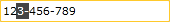

# Working with Selection

The purpose of this tutorial is to walk you through the common task of configuring `RadMaskedInput` control for working with selection. The following "selection" features will be demonstrated:			

* [SelectionOnFocus](#selectiononfocus)

* [SelectionLength and SelectionStart](#selectionlength-and-selectionstart)

## SelectionOnFocus

The `SelectionOnFocus` property of the RadMaskedInput controls allows you to specify what will happen with the cursor when the control gets focus. The values for the SelectionOnFocus property are predefined in the SelectionOnFocus enumeration. It exposes the following members:				

* `SelectAll`&mdash;once a RadMaskedInput control is focused, it will select its whole text. 						

	__Example 1: Setting the SelectionOnFocus property to SelectAll__
	```XAML
		<telerik:RadMaskedTextInput Mask="###-###-###" SelectionOnFocus="SelectAll" />
	```

* `CaretToBeginning`&mdash;once a RadMaskedInput control is focused, the cursor will be positioned at its beginning.						

	__Example 2: Setting the SelectionOnFocus property to CaretToBeginning__
	```XAML
		<telerik:RadMaskedTextInput Mask="###-###-###" SelectionOnFocus="CaretToBeginning" />
	```

* `CaretToEnd`&mdash;once a RadMaskedInput control is focused, the cursor will be positioned at its end.						

	__Example 3: Setting the SelectionOnFocus property to CaretToEnd__
	```XAML
		<telerik:RadMaskedTextInput Mask="###-###-###" SelectionOnFocus="CaretToEnd" />
	```

* `Unchanged`&mdash;when a RadMaskedInput control is focused, the position of the cursor won't be changed.					

* `Default`&mdash;When a RadMaskedInput control is focused, the SelectionOnFocus behavior depends on the type of the control. This is the __default value__ for the SelectionOnFocus property.
	* In the `RadMaskedDateTimeInput` and `RadMaskedTextInput` the `Default` behavior will place the cursor at the beginning if the value of the control is still not set. Otherwise the control won't change the position of the cursor - the `Unchanged` behavior is applied.
	* In the `RadMaskedNumericInput` and the `RadMaskedCurrencyInput` controls the `Default` behavior will place the cursor before the decimal point if the value of the control is still not set. Otherwise the control will behave as if in the `Unchanged` mode.

* `DefaultSelectAll`&mdash;this property changes the SelectionOnFocus behavior of the control depending on the source of the focus. If a RadMaskedInput control is focused on mouse click, the Default behavior will be used. If, on the other hand, a RadMaskedInput is focused using the __Tab__ key, the `SelectAll` SelectionOnFocus behavior will be used.					

## SelectionLength and SelectionStart

The `SelectionStart` property gets or sets the starting point of the selected text in the RadMaskedInput, while the `SelectionLength` gets or sets the number of characters selected in the RadMaskedInput. Both of the properties could be used in a combination with the `GotFocus` event, like in the example below:				

__Example 4: Subscribe to the GotFocus event in XAML__
```XAML
    <telerik:RadMaskedTextInput Mask="###-###-###" x:Name="radMaskedTextInput" GotFocus="radMaskedTextInput_GotFocus"/>
```

__Example 5: Setting the SelectionStart and SelectionLength properties__
```C#
	private void radMaskedTextInput_GotFocus(object sender, RoutedEventArgs e)
	{
		radMaskedTextInput.SelectionStart = 2;
		radMaskedTextInput.SelectionLength = 2;
	}
```
```VB.NET
	Private Sub radMaskedTextInput_GotFocus(sender As Object, e As RoutedEventArgs)
		radMaskedTextInput.SelectionStart = 2
		radMaskedTextInput.SelectionLength = 2
	End Sub
```



## See Also
 * [UpdateValueEvent]()
 * [MaskTokens]()
 * [Common Features]()