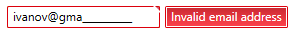

# Regex Validation

>important This feature is supported only by the __RadMaskedTextInput__ control.

RadMaskedTextInput allows you to enable an additional validation rule by defining a regular experession. The regex is applied over the value received after the Mask property validates the entered text.

## Setting Regular Expression

The regex can be set via the __ValidationRegex__ property of the RadMaskedTextInput control.


__Example 1: Setting regex validation__
```XAML
	<telerik:RadMaskedTextInput Mask="a20"                                    
								ValidationRegex="^([a-z0-9_\.-]+)@([\da-z\.-]+)\.([a-z\.]{2,6})$" 
								maskedInput:ValidationHelper.DisplayValidationErrors="True"  />		
```




__Example 1: Setting regex validation__
```XAML
	<telerik:RadMaskedTextInput Mask="a20"                                    
								ValidationRegex="^([a-z0-9_\.-]+)@([\da-z\.-]+)\.([a-z\.]{2,6})$" />		
```

							
__Example 1__ shows how to restrict the user to enter only a valid email address with a maximum text length of 20 alphanumeric or special characters.
							
> Take the [ValueMode]() property into account when composing the regular expression. Depending on the mode the Value of the control might contain placeholders and literals.

## Predefined Regular Expressions

The validation feature provides few predefined regular expressions that can be used.

* __Email__: This expression allows you to validate email addresses.
* __IP__: This expression allows you to validate IP addresses.

You can access the predefined regular expressions via the __ValidationHelper__ class. It exposes the regexes via static readonly properties. 

> The ValidationHelper class can be found in the following namespace: `xmlns:maskedInput="clr-namespace:Telerik.Windows.Controls.MaskedInput;assembly=Telerik.Windows.Controls.Input"`

__Example 2: Setting predefined regex in XAML__
```XAML
	<telerik:RadMaskedTextInput ValidationRegex="{x:Static maskedInput:ValidationHelper.Email}" />		
```

__Example 3: Setting predefined regex in code__
```C#
	this.maskedTextInput.ValidationRegex = ValidationHelper.Email;
```

## Set Error Message

You can set the error that will be shown in the validation tooltip via the __ErrorMessage__ property of the RadMaskedInput control.

__Example 4: Setting predefined error message in XAML__
```XAML
	<telerik:RadMaskedTextInput ErrorMessage="Invalid email address"/>
```

#### __Figure 1: Custom error message__



## Display Validation Errors

The visual element that presents the validation errors is not displayed by default when there is an error. If you want to display it set the __ValidationHelper.DisplayValidationErrors__ attached property on the masked input control to __True__.

__Example 5: Enabling the validation errors visual__
```XAML
	<telerik:RadMaskedTextInput maskedInput:ValidationHelper.DisplayValidationErrors="True"  />
```


## See Also
* [Getting Started]()
* [Mask Tokens]()


