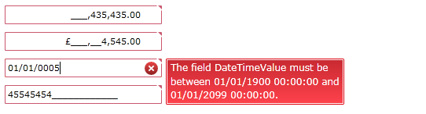
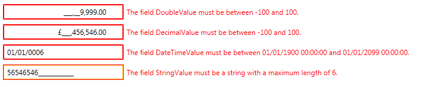

# Using DataAnnotation Attributes

## Validating Input Through Data Annotations

With the SilverlightWPF 4.0 platform you can take advantage of the __System.ComponentModel.DataAnnotations__ assembly. The following code snippet demonstrates how to use data annotation attributes to validate a property value. It is even better when you use __RIA services__, since this code will be automatically added for you by the __RIA Service's__ code generator.
		

#### __C#__

{{region radmaskedinput-features-validation_5}}
	public class DataAnnotationAttributesValidationViewModel : ViewModelBase
	{
			private double doubleValue;
			private string stringValue;
			private decimal decimalValue;
			private DateTime dateTimeValue;
			[Range(-100d, 100d)]
			public double DoubleValue
			{
				get { return doubleValue; }
				set
				{
					Validator.ValidateProperty(value, new ValidationContext(this, null, null) { MemberName = "DoubleValue" });
					doubleValue = value;
					this.OnPropertyChanged("DoubleValue");
				}
			}
			[Range(typeof(decimal), "-100", "100")]
			public decimal DecimalValue
			{
				get { return decimalValue; }
				set
				{
					Validator.ValidateProperty(value, new ValidationContext(this, null, null) { MemberName = "DecimalValue" });
					decimalValue = value;
					this.OnPropertyChanged("DecimalValue");
				}
			}
			[Range(typeof(DateTime), "01.01.1900", "01.01.2099")]
			public DateTime DateTimeValue
			{
				get { return dateTimeValue; }
				set
				{
					Validator.ValidateProperty(value, new ValidationContext(this, null, null) { MemberName = "DateTimeValue" });
					dateTimeValue = value;
					this.OnPropertyChanged("DateTimeValue");
				}
			}
			[StringLength(6)]
			[Required()]
			public string StringValue
			{
				get { return stringValue; }
				set
				{
					Validator.ValidateProperty(value, new ValidationContext(this, null, null) {MemberName = "StringValue"});
					stringValue = value;
					this.OnPropertyChanged("StringValue");
				}
			}
		}
	}
	
	{{endregion}}

#### __VB.NET__

{{region radmaskedinput-features-validation_6}}
	Public Class DataAnnotationAttributesValidationViewModel
	        Inherits ViewModelBase
	        Private m_doubleValue As Double
	        Private m_stringValue As String
	        Private m_decimalValue As Decimal
	        Private m_dateTimeValue As DateTime
	
	        <Range(-100.0, 100.0)> _
	        Public Property DoubleValue() As Double
	                Get
	                        Return m_doubleValue
	                End Get
	                Set
							Validator.ValidateProperty(value, New ValidationContext(Me, Nothing, Nothing) With { .MemberName = "DateTimeValue" })
	                        m_doubleValue = value
	                        Me.OnPropertyChanged("DoubleValue")
	                End Set
	        End Property
	
	        <Range(GetType(Decimal), "-100", "100")> _
	        Public Property DecimalValue() As Decimal
	                Get
	                        Return m_decimalValue
	                End Get
	                Set
							Validator.ValidateProperty(value, New ValidationContext(Me, Nothing, Nothing) With { .MemberName = "DecimalValue"})
	                        m_decimalValue = value
	                        Me.OnPropertyChanged("DecimalValue")
	                End Set
	        End Property
	
	        <Range(GetType(DateTime), "01.01.1900", "01.01.2099")> _
	        Public Property DateTimeValue() As DateTime
	                Get
	                        Return m_dateTimeValue
	                End Get
	                Set
							Validator.ValidateProperty(value, New ValidationContext(Me, Nothing, Nothing) With { .MemberName = "DateTimeValue"})
	                        m_dateTimeValue = value
	                        Me.OnPropertyChanged("DateTimeValue")
	                End Set
	        End Property
	
	        <StringLength(6)> _
	        <Required> _
	        Public Property StringValue() As String
	                Get
	                        Return m_stringValue
	                End Get
	                Set
							Validator.ValidateProperty(value, New ValidationContext(Me, Nothing, Nothing) With { .MemberName = "StringValue"})
	                        m_stringValue = value
	                        Me.OnPropertyChanged("StringValue")
	                End Set
	        End Property
	End Class
	{{endregion}}

>In order to use DataAnnotations you should add a reference to the __System.ComponentModel.DataAnnotations__ assembly.
		  

>importantNote that you have to invoke the __Validator.ValidateProperty__ method before setting a new value in the property setter.
		  

Now we need to define several __RadMaskedInput__ controls in XAML for displaying the sample data:
		

#### __XAML__

{{region radmaskedinput-features-validation_7}}
	<Grid>
	    <Grid.RowDefinitions>
	        <RowDefinition Height="Auto" />
	        <RowDefinition Height="Auto" />
	        <RowDefinition Height="Auto" />
	        <RowDefinition Height="Auto" />
	    </Grid.RowDefinitions>
	    	<telerik:RadMaskedNumericInput x:Name="radMaskedNumericInput" Grid.Row="0" Width="200" AllowInvalidValues="True"
						Margin="10, 10, 10, 0" ErrorMessage="{Binding Path=Text, ElementName=customErrorMessage}"
						InputBehavior="Insert"
						Value="{Binding Path=DoubleValue, Mode=TwoWay, ValidatesOnExceptions=True}" />
				<telerik:RadMaskedCurrencyInput x:Name="radMaskedCurrencyInput" Grid.Row="1" Width="200" AllowInvalidValues="True"
						Margin="10, 10, 10, 0" ErrorMessage="{Binding Path=Text, ElementName=customErrorMessage}"
						InputBehavior="Insert"
						Value="{Binding Path=DecimalValue, Mode=TwoWay, ValidatesOnExceptions=True}" />
				<telerik:RadMaskedDateTimeInput x:Name="radMaskedDateTimeInput" Grid.Row="2" Width="200" AllowInvalidValues="True"
						Margin="10, 10, 10, 0" ErrorMessage="{Binding Path=Text, ElementName=customErrorMessage}"
						Value="{Binding Path=DateTimeValue, Mode=TwoWay, ValidatesOnExceptions=True}" />
				<telerik:RadMaskedTextInput x:Name="radMaskedTextInput" Grid.Row="3" Width="200" Margin="10"
						ErrorMessage="{Binding Path=Text, ElementName=customErrorMessage}" AllowInvalidValues="True"
						Value="{Binding Path=StringValue, Mode=TwoWay,ValidatesOnExceptions=True}" />
	</Grid>
	{{endregion}}

>importantNote that you have set __AllowInvalidValues__ to True. This ensures that the Setter of the properties will be fired even if the DataAnnotaion Validation does not succeed.
		  

And finally we need to set the __DataContext__ accordingly:
		

#### __C#__

{{region radmaskedinput-features-validation_8}}
	this.DataContext = new DataAnnotationAttributesValidationViewModel();
	{{endregion}}

#### __VB.NET__

{{region radmaskedinput-features-validation_9}}
	Me.DataContext = New DataAnnotationAttributesValidationViewModel()
	{{endregion}}

Below you can see how the MaskedInputs are being validated:
		  



>tipYou can see a live demo demonstrating the __DataValidation__feature [here](http://demos.telerik.com/silverlight/#MaskedInput/Validation).

The RadMaskedInput controls support two properties that allow you to further customize your DataValidation scenarios:

* __IsMaskValid__ - when this property is __False__, the entered input is invalid
			  

* __IsValidationHintVisisble__ - this property allows you to turn on and off the __MaskedInput__ controls validation hint
			  

>tipThe data annotation attributes fall into three categories: validation attributes, display attributes, and data modeling attributes. You can find more info [here](http://msdn.microsoft.com/en-us/library/dd901590%28v=vs.95%29.aspx).
		  

You can find example with __RegularExpression__ attribute in the following section.
		  

## Regular Expressions

The __MaskedInput__ suite of controls allow validation through __Regular Expressions__. In order to implement __regex__ validation you will need a view model implementing the __INotifyPropertyChanged__ interface. For the purpose of this tutorial we will define a ViewModel that contains Email and WebAddress properties. For each property we will apply a regular expression to validate the user's input in the __MaskedInput__ control that will display the property accordingly.
		

First, we need a view model:

#### __C#__

{{region radmaskedinput-validation-regex_0}}
	public class MaskedInputViewModel  : ViewModelBase
	{
	 private string email = "username@email.com";
	 /// 

	 ///     Gets or sets the email.
	 /// 

	 [RegularExpression(@"\b[a-z0-9._%-]+@[a-z0-9.-]+\.[a-z]{2,4}\b", ErrorMessage = "Invalid Email Address.")]
	 public string Email
	 {
	  get
	  {
	   return this.email;
	  }
	  set
	  {
	   if (this.email != value)
	   {
	    Validator.ValidateProperty(value, new ValidationContext(this, null, null) { MemberName = "Email" });
	    this.email = value;
	    OnPropertyChanged("Email");
	   }
	  }
	 } private string webAddress = http://www.sampleaddress.com;
	 /// 

	 ///     Gets or sets the webAddress.
	 /// 

	 [RegularExpression(@"http://www.+\b[a-z0-9._%-]+\.[a-z]{2,4}\b", ErrorMessage = "Invalid Web Address.")]
	 public string WebAddress
	 {
	  get
	  {
	   return this.webAddress;
	  }
	  set
	  {
	   if (this.webAddress != value)
	   {
	    Validator.ValidateProperty(value, new ValidationContext(this, null, null) { MemberName = "WebAddress" });
	    this.webAddress = value;
	    OnPropertyChanged("WebAddress");
	   }
	  }
	 }
	}
	{{endregion}}

#### __VB.NET__

{{region radmaskedinput-validation-regex_1}}
	Public Class MaskedInputViewModel
		Inherits ViewModelBase
		Private m_email As String = "username@email.com"
		''' 

		'''     Gets or sets the email.
		''' 

		<RegularExpression("\b[a-z0-9._%-]+@[a-z0-9.-]+\.[a-z]{2,4}\b", ErrorMessage = "Invalid Email Address.")> _
		Public Property Email() As String
			Get
				Return Me.m_email
			End Get
			Set
				If Me.m_email <> value Then
				    Validator.ValidateProperty(value, New ValidationContext(Me, Nothing, Nothing) With { .MemberName = "Email" })
					Me.m_email = value
					OnPropertyChanged("Email")
				End If
			End Set
		End Property
	
		Private m_webAddress As String = "http://www.sampleaddress.com"
		''' 

		'''     Gets or sets the webAddress.
		''' 

		<RegularExpression("http://www.+\b[a-z0-9._%-]+\.[a-z]{2,4}\b", ErrorMessage = "Invalid Web Address.")> _
		Public Property WebAddress() As String
			Get
				Return Me.m_webAddress
			End Get
			Set
				If Me.m_webAddress <> value Then
				    Validator.ValidateProperty(value, New ValidationContext(Me, Nothing, Nothing) With { .MemberName = "WebAddress" })
					Me.m_webAddress = value
					OnPropertyChanged("WebAddress")
				End If
			End Set
		End Property
	
	End Class
	{{endregion}}

>importantNote that you have to invoke the __Validator.ValidateProperty__ method before setting a new value in the property setter.
		  

In the above __MaskedInputViewModel__ implementation it is important to note the __regular expressions__ that validate the Email and WebAddress properties, as well as the custom __ErrorMessage__that is defined for each property. In order to  apply such attributes that specify validation rules, you need to add a reference to the [System.ComponentModel.DataAnnotations](http://msdn.microsoft.com/en-us/library/system.componentmodel.dataannotations%28v=vs.95%29.aspx)[System.ComponentModel.DataAnnotations](http://msdn.microsoft.com/en-us/library/system.componentmodel.dataannotations.aspx) namespace.
		
Then you can define the __RadMaskedInput__controls that will display the Email and WebAddress business properties:
		

#### __XAML__

{{region radmaskedinput-validation-regex_2}}
	<telerik:RadMaskedTextInput AllowInvalidValues="True" Value="{Binding Path=Email, Mode=TwoWay, ValidatesOnExceptions=True}" VerticalAlignment="Center"/>
	<telerik:RadMaskedTextInput AllowInvalidValues="True" Value="{Binding Path=WebAddress, Mode=TwoWay, ValidatesOnExceptions=True}" Mask="a30"
	                        VerticalAlignment="Center" />
	{{endregion}}

>importantNote that you have set __AllowInvalidValues__ to True. This ensures that the Setter of the properties will be fired even if the DataAnnotaion Validation does not succeed.
		  
And finally you need to set the __MaskedInputViewModel__as __DataContext__ of the __MaskedTextInput__controls:
		

#### __XAML__

{{region radmaskedinput-validation-regex_3}}
	<UserControl x:Class="MaskedInputValidation.MainPage" 
	             xmlns="http://schemas.microsoft.com/winfx/2006/xaml/presentation"
	             xmlns:x="http://schemas.microsoft.com/winfx/2006/xaml"
	             xmlns:d="http://schemas.microsoft.com/expression/blend/2008"
	             xmlns:mc="http://schemas.openxmlformats.org/markup-compatibility/2006"
	             xmlns:telerik="http://schemas.telerik.com/2008/xaml/presentation"
	             xmlns:vm="clr-namespace:MaskedInputValidation"
	             d:DesignHeight="300"
	             d:DesignWidth="400"
	             mc:Ignorable="d">
	    <UserControl.DataContext>
	        <vm:MaskedInputViewModel />
	    </UserControl.DataContext>
	    <Grid x:Name="LayoutRoot" Background="White">
	        <StackPanel>
	            <StackPanel Margin="5" Orientation="Horizontal">
	                <TextBlock VerticalAlignment="Center" Text="Enter Email Address: " />
	                <telerik:RadMaskedTextInput VerticalAlignment="Center" AllowInvalidValues="True" All Value="{Binding Path=Email, Mode=TwoWay, ValidatesOnExceptions=True}" />
	            </StackPanel>
	            <StackPanel Margin="5" Orientation="Horizontal">
	                <TextBlock VerticalAlignment="Center" Text="Enter Web Address: " />
	                <telerik:RadMaskedTextInput VerticalAlignment="Center" AllowInvalidValues="True"
	                                            Mask="a30"
	                                            Value="{Binding Path=WebAddress, Mode=TwoWay, ValidatesOnExceptions=True}" />
	            </StackPanel>
	        </StackPanel>
	    </Grid>
	</UserControl>
	{{endregion}}