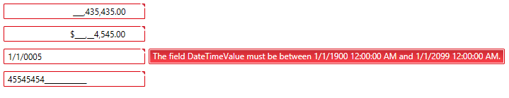

# Using DataAnnotation Attributes

## Validating Input Through Data Annotations

With the {{ site.framework_name }} framework you can take advantage of the __System.ComponentModel.DataAnnotations__ assembly. The following code snippet demonstrates how to use data annotation attributes to validate a property value. It is even better when you use __RIA services__, since this code will be automatically added for you by the __RIA Service's__ code generator.		

__Example 1: Creating DataAnnotationAttributesValidationViewModel class__
<snippet id='radmaskedinput-features-validation-regex-block_1-cs' />
<snippet id='radmaskedinput-features-validation-regex-block_1-vb' />

>In order to use DataAnnotations you should add a reference to the __System.ComponentModel.DataAnnotations__ assembly.		  

>important Note that you have to invoke the __Validator.ValidateProperty__ method before setting a new value in the property setter.		  

Now we need to define several __RadMaskedInput__ controls in XAML for displaying the sample data:		

__Example 2: Defining several RadMaskedInput controls__
<snippet id='radmaskedinput-features-validation-regex-block_2-xaml' />

>important Note that you have set __AllowInvalidValues__ to True. This ensures that the Setter of the properties will be fired even if the DataAnnotaion Validation does not succeed.		  

And finally we need to set the __DataContext__ accordingly:		

__Example 3: Setting the DataContext to the view model__
<snippet id='radmaskedinput-features-validation-regex-block_3-cs' />
<snippet id='radmaskedinput-features-validation-regex-block_3-vb' />

Below you can see how the MaskedInputs are being validated:		  

## Regular Expressions

The __MaskedInput__ suite of controls allow validation through __Regular Expressions__. In order to implement __regex__ validation you will need a view model implementing the __INotifyPropertyChanged__ interface. For the purpose of this tutorial we will define a ViewModel that contains Email and WebAddress properties. For each property we will apply a regular expression to validate the user's input in the __MaskedInput__ control that will display the property accordingly.		

First, we need a view model:

__Example 4: Creating MaskedInputViewModel class__
<snippet id='radmaskedinput-features-validation-regex-block_4-cs' />
<snippet id='radmaskedinput-features-validation-regex-block_4-vb' />

>important Note that you have to invoke the __Validator.ValidateProperty__ method before setting a new value in the property setter.

In the above __MaskedInputViewModel__ implementation it is important to note the __regular expressions__ that validate the Email and WebAddress properties, as well as the custom __ErrorMessage__ that is defined for each property. In order to  apply such attributes that specify validation rules, you need to add a reference to the [System.ComponentModel.DataAnnotations](http://msdn.microsoft.com/en-us/library/system.componentmodel.dataannotations.aspx) namespace.
		
Then you can define the __RadMaskedInput__ controls that will display the Email and WebAddress business properties:		

__Example 5: Defining  RadMaskedInput controls in XAML__
<snippet id='radmaskedinput-features-validation-regex-block_5-xaml' />

>important Note that you have set __AllowInvalidValues__ to True. This ensures that the Setter of the properties will be fired even if the DataAnnotaion Validation does not succeed.
		  
And finally you need to set the __MaskedInputViewModel__ as __DataContext__ of the __MaskedTextInput__ controls:		

__Example 6: Setting the DataContext in XAML__
<snippet id='radmaskedinput-features-validation-regex-block_6-xaml' />