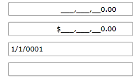
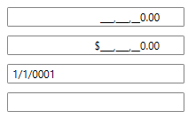
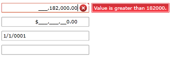
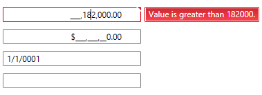

# Throwing Validation Exceptions

Masks do not necessarily guarantee that a user's input will represent a valid value for a given type; for example, -9 could be entered for an age in years. You can verify that a user's input represents a valid value by using __Data Validation__. The __RadMaskedInput__ controls provides out-of-the-box support for Data Validation. Data validation, being one of the major points when building line-of-business applications, can help you to easily separate the validation logic from the application's UI.  

This topic will show you how to use __RadMaskedInput__ controls to distinguish between proper and improper user input.	  

For the purpose of this tutorial you need to create a new class named __DataValidationViewModel__. It will take care of the validation rules.	  

__Example 1: Custom validation class__
```C#
	public class DataValidationViewModel : ViewModelBase
	{
		private double doubleValue;
		private string stringValue;
		private decimal decimalValue;
		private DateTime dateTimeValue;
		[Range(-100d, 100d)]
		public double DoubleValue
		{
			get { return doubleValue; }
			set
			{
				doubleValue = value;
				this.OnPropertyChanged("DoubleValue");
			}
		}
		[Range(typeof(decimal), "-100", "100")]
		public decimal DecimalValue
		{
			get { return decimalValue; }
			set
			{
				decimalValue = value;
				this.OnPropertyChanged("DecimalValue");
			}
		}
		[Range(typeof(DateTime), "01.01.1900", "01.01.2099")]
		public DateTime DateTimeValue
		{
			get { return dateTimeValue; }
			set
			{
				dateTimeValue = value;
				this.OnPropertyChanged("DateTimeValue");
			}
		}
		[StringLength(6)]
		[Required()]
		public string StringValue
		{
			get { return stringValue; }
			set
			{
				stringValue = value;
				this.OnPropertyChanged("StringValue");
			}
		}
	}
```
```VB.NET
	Public Class DataValidationViewModel
		Inherits ViewModelBase
		Private m_doubleValue As Double
		Private m_stringValue As String
		Private m_decimalValue As Decimal
		Private m_dateTimeValue As Date
		Public Property DoubleValue() As Double
			Get
				Return m_doubleValue
			End Get
			Set
				If Value < -100 OrElse Value > 100 Then
					Throw New ValidationException([String].Format("Value is {0} than {1}.", (If(Value > 100, "greater", "less")), Value))
				End If
				m_doubleValue = Value
				Me.OnPropertyChanged("DoubleValue")
			End Set
		End Property
		Public Property DecimalValue() As Decimal
			Get
				Return m_decimalValue
			End Get
			Set
				If Value < -100 OrElse Value > 100 Then
					Throw New ValidationException([String].Format("Value is {0} than {1}.", (If(Value > 100, "greater", "less")), Value))
				End If
				m_decimalValue = Value
				Me.OnPropertyChanged("DecimalValue")
			End Set
		End Property
		Public Property DateTimeValue() As Date
			Get
				Return m_dateTimeValue
			End Get
			Set
				If Value < Date.Parse("01.01.1900") OrElse Value > Date.Parse("01.01.2099") Then
					Throw New ValidationException([String].Format("Value is {0} than {1}.", (If(Value > Date.Parse("01.01.2099"), "greater", "less")), Value))
				End If
				m_dateTimeValue = Value
				Me.OnPropertyChanged("DateTimeValue")
			End Set
		End Property
		Public Property StringValue() As String
			Get
				Return m_stringValue
			End Get
			Set
				If Value.Length > 6 Then
					Throw New ValidationException([String].Format("Value's length is greater than {0}.", Value.Length))
				End If
				m_stringValue = Value
				Me.OnPropertyChanged("StringValue")
			End Set
		End Property
	End Class
```

Declare several __RadMaskedInput__ controls in XAML for displaying the sample data. Pay attention on the following things:	  

* The __RadMaskedInput__ controls' __Value__ property is data bound to the corresponding property in the ViewModel.		  

* The __ValidatesOnExceptions__ and __NotifyOnValidationError__ properties of the data binding are set to __True__.		  

__Example 2: Defining several RadMaskedInput controls in XAML__
```XAML
	<StackPanel x:Name="LayoutRoot" Background="White">
	    <telerik:RadMaskedNumericInput Width="200"
	                                    Margin="10, 10, 10, 0"
	                                    ErrorMessage="{Binding Path=Text, ElementName=customErrorMessage}"
	                                    InputBehavior="Insert"
	                                    Value="{Binding Path=DoubleValue, Mode=TwoWay, NotifyOnValidationError=True, ValidatesOnExceptions=True}" />
	    <telerik:RadMaskedCurrencyInput Width="200"
	                                    Margin="10, 10, 10, 0"
	                                    ErrorMessage="{Binding Path=Text, ElementName=customErrorMessage}"
	                                    InputBehavior="Insert"
	                                    Value="{Binding Path=DecimalValue, Mode=TwoWay, NotifyOnValidationError=True, ValidatesOnExceptions=True}" />
	    <telerik:RadMaskedDateTimeInput Width="200"
	                                    Margin="10, 10, 10, 0"
	                                    ErrorMessage="{Binding Path=Text, ElementName=customErrorMessage}"
	                                    Value="{Binding Path=DateTimeValue, Mode=TwoWay, NotifyOnValidationError=True, ValidatesOnExceptions=True}" />
	    <telerik:RadMaskedTextInput Width="200"
	                                Margin="10"
	                                ErrorMessage="{Binding Path=Text, ElementName=customErrorMessage}"
	                                Value="{Binding Path=StringValue, Mode=TwoWay, NotifyOnValidationError=True, ValidatesOnExceptions=True}" />
	</StackPanel>
```

Finally, set the DataValidationViewModel to the UserControl's __DataContext__ property.	  

__Example 3: Setting the DataContext to DataValidationViewModel__
```C#
	this.DataContext = new DataValidationViewModel();
```
```VB.NET
	Me.DataContext = New DataValidationViewModel()
```

Run the demo and fill all fields with valid data. As you can see no validation errors occur.




Next try to fill some improper data.




## See Also
 * [Getting Started]()
 * [Common Features]()
