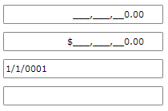
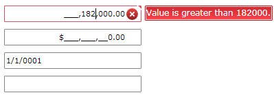
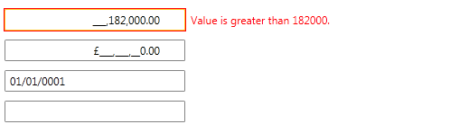

# Throwing Validation Exceptions

Masks do not necessarily guarantee that a user's input will represent a valid value for a given type; for example, -9 could be entered for an age in years. You can verify that a user's input represents a valid value by using __Data Validation__. The __RadMaskedInput__ controls provides out-of-the-box support for Data Validation. Data validation, being one of the major points when building line-of-business applications, can help you to easily separate the validation logic from the application's UI.
	  

This topic will show you how to use __RadMaskedInput__ controls to distinguish between proper and improper user input.
	  

For the purpose of this tutorial you need to create a new class named __DataValidationViewModel__. It will take care of the validation rules.
	  

#### __C#__

{{region radmaskedinput-features-validation_1}}
	public class DataValidationViewModel : ViewModelBase
	{
		private double doubleValue;
		private string stringValue;
		private decimal decimalValue;
		private DateTime dateTimeValue;
	
		public double DoubleValue 
		{
			get { return doubleValue; }
			set 
	        {
				if (value < -100 || value > 100) 
	            {
					throw new ValidationException(String.Format("Value is {0} than {1}.", (value > 100 ? "greater" : "less"), value));
				}
				doubleValue = value;
				this.OnPropertyChanged("DoubleValue");
			}
		}
	
		public decimal DecimalValue 
		{
			get { return decimalValue; }
			set 
	        {
				if (value < -100 || value > 100) 
	            {
					throw new ValidationException(String.Format("Value is {0} than {1}.", (value > 100 ? "greater" : "less"), value));
				}
				decimalValue = value;
				this.OnPropertyChanged("DecimalValue");
			}
		}
	
		public DateTime DateTimeValue 
		{
			get { return dateTimeValue; }
			set 
	        {
				if (value < DateTime.Parse("01.01.1900") || value > DateTime.Parse("01.01.2099")) 
	            {
					throw new ValidationException(String.Format("Value is {0} than {1}.", (value > DateTime.Parse("01.01.2099") ? "greater" : "less"), value));
				}
				dateTimeValue = value;
				this.OnPropertyChanged("DateTimeValue");
			}
		}
	
		public string StringValue 
		{
			get { return stringValue; }
			set 
	        {
				if (value.Length > 6) 
	            {
					throw new ValidationException(String.Format("Value's length is greater than {0}.", value.Length));
				}
				stringValue = value;
				this.OnPropertyChanged("StringValue");
			}
		}
	}
	{{endregion}}

#### __VB.NET__

{{region radmaskedinput-features-validation_1}}
	Public Class DataValidationViewModel
	        Inherits ViewModelBase
	        Private m_doubleValue As Double
	        Private m_stringValue As String
	        Private m_decimalValue As Decimal
	        Private m_dateTimeValue As DateTime
	
	        Public Property DoubleValue() As Double
	                Get
	                        Return m_doubleValue
	                End Get
	                Set				
	                        If value < -100 OrElse value > 100 Then
	                                Throw New ValidationException([String].Format("Value is {0} than {1}.", (If(value > 100, "greater", "less")), value))
	                        End If
	                        m_doubleValue = value
	                        Me.OnPropertyChanged("DoubleValue")
	                End Set
	        End Property
	
	        Public Property DecimalValue() As Decimal
	                Get
	                        Return m_decimalValue
	                End Get
	                Set
	                        If value < -100 OrElse value > 100 Then
	                                Throw New ValidationException([String].Format("Value is {0} than {1}.", (If(value > 100, "greater", "less")), value))
	                        End If
	                        m_decimalValue = value
	                        Me.OnPropertyChanged("DecimalValue")
	                End Set
	        End Property
	
	        Public Property DateTimeValue() As DateTime
	                Get
	                        Return m_dateTimeValue
	                End Get
	                Set
	                        If value < DateTime.Parse("01.01.1900") OrElse value > DateTime.Parse("01.01.2099") Then
	                                Throw New ValidationException([String].Format("Value is {0} than {1}.", (If(value > DateTime.Parse("01.01.2099"), "greater", "less")), value))
	                        End If
	                        m_dateTimeValue = value
	                        Me.OnPropertyChanged("DateTimeValue")
	                End Set
	        End Property
	
	        Public Property StringValue() As String
	                Get
	                        Return m_stringValue
	                End Get
	                Set
	                        If value.Length > 6 Then
	                                Throw New ValidationException([String].Format("Value's length is greater than {0}.", value.Length))
	                        End If
	                        m_stringValue = value
	                        Me.OnPropertyChanged("StringValue")
	                End Set
	        End Property
	End Class
	{{endregion}}

Declare several __RadMaskedInput__ controls in XAML for displaying the sample data. Pay attention on the following things:
	  

* The __RadMaskedInput__ controls' __Value__ property is data bound to the corresponding property in the ViewModel.
		  

* The __ValidatesOnExceptions__ and __NotifyOnValidationError__ properties of the data binding are set to __True__.
		  

#### __XAML__

{{region radmaskedinput-features-validation_2}}
	<StackPanel x:Name="LayoutRoot" Background="White">
	    <telerik:RadMaskedNumericInput x:Name="radMaskedNumericInput" 
	                                    Width="200"
	                                    Margin="10, 10, 10, 0"
	                                    ErrorMessage="{Binding Path=Text, ElementName=customErrorMessage}"
	                                    InputBehavior="Insert"
	                                    Value="{Binding Path=DoubleValue, Mode=TwoWay, NotifyOnValidationError=True, ValidatesOnExceptions=True}" />
	    <telerik:RadMaskedCurrencyInput x:Name="radMaskedCurrencyInput" 
	                                    Width="200"
	                                    Margin="10, 10, 10, 0"
	                                    ErrorMessage="{Binding Path=Text, ElementName=customErrorMessage}"
	                                    InputBehavior="Insert"
	                                    Value="{Binding Path=DecimalValue, Mode=TwoWay, NotifyOnValidationError=True, ValidatesOnExceptions=True}" />
	    <telerik:RadMaskedDateTimeInput x:Name="radMaskedDateTimeInput" 
	                                    Width="200"
	                                    Margin="10, 10, 10, 0"
	                                    ErrorMessage="{Binding Path=Text, ElementName=customErrorMessage}"
	                                    Value="{Binding Path=DateTimeValue, Mode=TwoWay, NotifyOnValidationError=True, ValidatesOnExceptions=True}" />
	    <telerik:RadMaskedTextInput x:Name="radMaskedTextInput" 
	                                Width="200"
	                                Margin="10"
	                                ErrorMessage="{Binding Path=Text, ElementName=customErrorMessage}"
	                                Value="{Binding Path=StringValue, Mode=TwoWay, NotifyOnValidationError=True, ValidatesOnExceptions=True}" />
	</StackPanel>
	{{endregion}}

Finally, set the DataValidationViewModel to the UserControl's __DataContext__ property.
	  

#### __C#__

{{region radmaskedinput-features-validation_3}}
	this.DataContext = new DataValidationViewModel();
	{{endregion}}

#### __VB.NET__

{{region radmaskedinput-features-validation_4}}
	Me.DataContext = New DataValidationViewModel()
	{{endregion}}

Run the demo and fill all fields with valid data. As you can see no validation errors occur.

Next try to fill some improper data.




# See Also

 * [Getting Started]()

 * [Common Features]()
