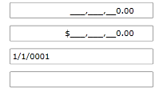
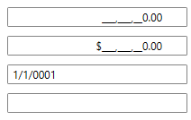
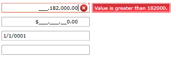
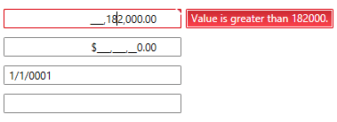

# Throwing Validation Exceptions

Masks do not necessarily guarantee that a user's input will represent a valid value for a given type; for example, -9 could be entered for an age in years. You can verify that a user's input represents a valid value by using __Data Validation__. The __RadMaskedInput__ controls provides out-of-the-box support for Data Validation. Data validation, being one of the major points when building line-of-business applications, can help you to easily separate the validation logic from the application's UI.  

This topic will show you how to use __RadMaskedInput__ controls to distinguish between proper and improper user input.	  

For the purpose of this tutorial you need to create a new class named __DataValidationViewModel__. It will take care of the validation rules.	  

__Example 1: Custom validation class__
<snippet id='radmaskedinput-features-validation-validation-block_1-cs' />
<snippet id='radmaskedinput-features-validation-validation-block_1-vb' />

Declare several __RadMaskedInput__ controls in XAML for displaying the sample data. Pay attention on the following things:	  

* The __RadMaskedInput__ controls' __Value__ property is data bound to the corresponding property in the ViewModel.		  

* The __ValidatesOnExceptions__ and __NotifyOnValidationError__ properties of the data binding are set to __True__.		  

__Example 2: Defining several RadMaskedInput controls in XAML__
<snippet id='radmaskedinput-features-validation-validation-block_2-xaml' />

Finally, set the DataValidationViewModel to the UserControl's __DataContext__ property.	  

__Example 3: Setting the DataContext to DataValidationViewModel__
<snippet id='radmaskedinput-features-validation-validation-block_3-cs' />
<snippet id='radmaskedinput-features-validation-validation-block_3-vb' />

Run the demo and fill all fields with valid data. As you can see no validation errors occur.




Next try to fill some improper data.




## See Also
 * [Getting Started]()
 * [Common Features]()