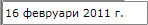

# Getting Started with {{ site.framework_name }} MaskedInput

The __RadMaskedInput__ controls use a mask to distinguish between proper and improper user input. The __RadMaskedInput__ controls are enhanced TextBox controls that support a declarative syntax for accepting or rejecting user input. Using the __Mask__ property, you can specify the following input without writing any custom validation logic in your application:			

* Required input characters. 

* Optional input characters. 

* The type of input expected at a given position in the mask; for example, a digit, or an alphabetic or alphanumeric character.				

* Mask literals, or characters that should appear directly in the __RadMaskedInput__ control; for example, the hyphens (-) in a phone number, or the currency symbol in a price.				

When a __RadMaskedInput__ control is displayed at run time, it represents the mask as a series of prompt characters and optional literal characters. Each editable mask position, representing a required or optional input, is shown with a single placeholder character. For example, the number sign (#) is used as a placeholder for a numeric character input. You can use the [Placeholder]() property to specify a custom placeholder character. The [EmptyContent]() property could be used to determine what will be displayed when the user specifies a null value and the control loses its focus.			

As the user types input into a __RadMaskedInput__ control, valid input characters replace their respective placeholder characters in a sequential fashion. If the user types an invalid input character, no replacement occurs. You can provide your own custom error by handling the __ValueChanging__ or/and __ValueChanged__ events.			

You can use the __Value__ property, to get the user input without the formatted characters. The __Text__ property will always retreive the user's input formatted according to the __Mask__ and the __TextMode__ property.			

Masks do not necessarily guarantee that a user's input will represent a valid value for a given type; for example, -9 could be entered for an age in years. You can verify that a user's input represents a valid value by taking advantage of the __RadMaskedInput__ controls' built in support for SilverlightWPF [Validation]().

## RadMaskedInput Controls

There are four __RadMaskedInput__ controls that you can use in order to further specify how masks should be interpreted:				

* [RadMaskedNumericInput]() - the control is used to display numeric values. This is why its __Value__ property is of type __double?__.					

* [RadMaskedCurrencyInput]() - the control is used to display culture-aware currency values. This is why its __Value__ property is of type __decimal?__.					

* [RadMaskedTextInput]() - the control is used to display text characters. This is why its __Value__ property is of type __string__.					

* [RadMaskedDateTimeInput]() - the control is used to display __DateTime__ values. This is why its __Value__ property is of type __System.DateTime?__.					

## Adding Telerik Assemblies Using NuGet

To use __RadMaskedInput__ when working with NuGet packages, install the `Telerik.Windows.Controls.Input.for.Wpf.Xaml` package. The [package name may vary]() slightly based on the Telerik dlls set - [Xaml or NoXaml]()

Read more about NuGet installation in the [Installing UI for WPF from NuGet Package]() article.

>tip With the 2025 Q1 release, the Telerik UI for WPF has a new licensing mechanism. You can learn more about it [here]().

## Adding Assembly References Manually

If you are not using NuGet packages, you can add a reference to the following assemblies:

* __Telerik.Licensing.Runtime__
* __Telerik.Windows.Controls__
* __Telerik.Windows.Controls.Input__
* __Telerik.Windows.Data__  

You can find more info [here]().

After adding the NuGet package or manually referencing the assemblies, you can declare a new __RadMaskedInput__ control as any normal SilverlightWPF control.				

#### __[XAML] Example 1: Declare RadMaskedInput controls in XAML__
{{region xaml-radmaskedinput-getting-started_0}}
	<UserControl 
	            xmlns:telerik="http://schemas.telerik.com/2008/xaml/presentation">
	   <StackPanel x:Name="LayoutRoot"
	         Background="White"> 
	       <telerik:RadMaskedTextInput x:Name="radMaskedTextInput" />
	       <telerik:RadMaskedCurrencyInput x:Name="radMaskedCurrencyInput" />
	       <telerik:RadMaskedDateTimeInput x:Name="radMaskedDateTimeInput" /> 
	       <telerik:RadMaskedNumericInput x:Name="radMaskedNumericInput" /> 
	   </StackPanel>
	</UserControl>
{{endregion}}

## Set the Mask Property

Although each __RadMaskedInput__ component is designed to work with specific type of input, you can further restrict the entered value through the __Mask__ property. 				

* __Mask__ - gets or sets a string of characters that constrain user input. The __Mask__ property may contain literals and special mask characters. You can use the back slash character to escape any special mask characters so that they are displayed as literals.
					
The following code example initializes the __RadMaskedDateTimeInput__ to accept a date in a long date format.				

#### __[XAML] Example 2: Set mask property__
{{region xaml-radmaskedinput-getting-started_1}}
	<telerik:RadMaskedDateTimeInput  Mask="D"/>
{{endregion}}

## Change the Default Placeholder Character

The __Placeholder__ property represents the character displayed in any blank space defined by a __Mask__ character. By default the character is an underscore.				

#### __[XAML] Example 3: Set custom character to the Placeholder property__
{{region xaml-radmaskedinput-getting-started_2}}
	<telerik:RadMaskedCurrencyInput Placeholder="$" />
{{endregion}}

## Change the Culture

The __Culture__ property allows you to set the current language and culture from a drop-down list at design-time or to assign a new __CultureInfo__ instance at run-time.
				
The following code example initializes the __RadMaskedDateTimeInput__ to accept a Bulgarian date in a long date format.				

#### __[XAML] Example 3: Change the Culture property__
{{region xaml-radmaskedinput-getting-started_3}}
	<telerik:RadMaskedDateTimeInput Mask="D"
	                                Culture="bg-BG" />
{{endregion}}

>tip For more information check out the following [Globalization Support]() topic.				

## Set Watermark

You can set a watermark content to the __RadMaskedInput__ controls by using the __EmptyContent__ and the __EmptyContentTemplate__ properties. When the __Value__ of a __RadMaskedTextInput__ control is null or empty the __EmptyContent__ will be displayed.				

#### __[XAML] Example 4: Set custom value to the EmptyContent property__
{{region xaml-radmaskedinput-getting-started_4}}
	<telerik:RadMaskedTextInput Mask="####" EmptyContent="Please Enter Four Digits" />
{{endregion}}

## Setting a Theme

The controls from our suite support different themes. You can see how to apply a theme different than the default one in the [Setting a Theme]() help article.

>important Changing the theme using implicit styles will affect all controls that have styles defined in the merged resource dictionaries. This is applicable only for the controls in the scope in which the resources are merged. 

To change the theme, you can follow the steps below:
* Choose between the themes and add reference to the corresponding theme assembly (ex: **Telerik.Windows.Themes.Windows8.dll**). You can see the different themes applied in the **Theming** examples from our [WPF Controls Examples](https://demos.telerik.com/wpf/)[Silverlight Controls Examples](https://demos.telerik.com/silverlight/#MaskedInput/Theming) application.

* Merge the ResourceDictionaries with the namespace required for the controls that you are using from the theme assembly. For __RadMaskedInput__, you will need to merge the following resources:

	* __Telerik.Windows.Controls__
	* __Telerik.Windows.Controls.Input__

__Example 4__ demonstrates how to merge the ResourceDictionaries so that they are applied globally for the entire application.

#### __[XAML] Example 4: Merge the ResourceDictionaries__  
{{region radmaskedinput-getting-started_5}}
	<Application.Resources>
		<ResourceDictionary>
			<ResourceDictionary.MergedDictionaries>
				<ResourceDictionary Source="/Telerik.Windows.Themes.Windows8;component/Themes/System.Windows.xaml"/>
				<ResourceDictionary Source="/Telerik.Windows.Themes.Windows8;component/Themes/Telerik.Windows.Controls.xaml"/>
				<ResourceDictionary Source="/Telerik.Windows.Themes.Windows8;component/Themes/Telerik.Windows.Controls.Input.xaml"/>				
			</ResourceDictionary.MergedDictionaries>
		</ResourceDictionary>
	</Application.Resources>
{{endregion}}

__Figure 1__ shows __RadMaskedInput__ with the **Windows8** theme applied.
	
#### __Figure 1: RadMaskedInput with the Windows8 theme__


## Telerik UI for WPF Learning Resources

* [Telerik UI for WPF MaskedInput Component](https://www.telerik.com/products/wpf/maskedinput.aspx)
* [Getting Started with Telerik UI for WPF Components]()
* [Telerik UI for WPF Installation]()
* [Telerik UI for WPF and WinForms Integration]()
* [Telerik UI for WPF Visual Studio Templates]()
* [Setting a Theme with Telerik UI for WPF]()
* [Telerik UI for WPF Virtual Classroom (Training Courses for Registered Users)](https://learn.telerik.com/learn/course/external/view/elearning/16/telerik-ui-for-wpf) 
* [Telerik UI for WPF License Agreement](https://www.telerik.com/purchase/license-agreement/wpf-dlw-s)


## See Also
 * [RadMaskedInput Controls Overview]()
 * [Events Overview]()
 * [Common Features]()
 * [MaskTokens]()
 * [Template Structure]()
