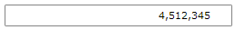

# How to Define Consecutive Input

In the __RadMaskedNumericInput__ and __RadMaskedCurrencyInput__ controls if in the user input is similar to __4_5,_12,345__, each placeholder indicating that no value is added is replaced by a __0__, thus displaying the value of __405,012,345__:

__Example 1: Each placeholder is replaced by 0__
```XAML
	<telerik:RadMaskedNumericInput HorizontalAlignment="Center"
								   Culture="en-US"
								   EmptyContent="Enter digits"
								   Mask="#9.0"
								   SelectionOnFocus="SelectAll"
								   SpinMode="PositionAndValue"
								   TextMode="PlainText"
								   UpdateValueEvent="LostFocus"
								   Value="12345" />
```


However, if you need to define a consecutive input so that entering a new digit to this number  _____,_12,345__ will result in adding the digit to the first available position: _____,412,345__, you can set the __AllowSkipPlaceholders__ property to __False__:

__Example 2: Setting the AllowSkipPlaceholders property__
```XAML
	<telerik:RadMaskedNumericInput HorizontalAlignment="Center"
								   AllowSkipPlaceholders="False"
								   Culture="en-US"
								   EmptyContent="Enter digits"
								   Mask="#9.0"
								   SelectionOnFocus="SelectAll"
								   SpinMode="PositionAndValue"
								   TextMode="PlainText"
								   UpdateValueEvent="LostFocus"
								   Value="12345" />
```

