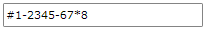

# How to Create Custom Mask Tokens

This article shows how to implement a custom mask token.

Find a list of all built-in mask tokens that can be used with the __RadMaskedInput__ controls in the [Mask Tokens]() article. 

To create a custom token, you should implement the [ITokenValidationRule](https://www.telerik.com/products/wpf/documentation/api/telerik.windows.controls.maskedinput.tokens.itokenvalidationrule) interface.

__Example 1: Creating custom class which inherits ITokenValidationRule interface__
<snippet id='radmaskedinput-how-to-howto-create-custom-token-block_1-cs' />
<snippet id='radmaskedinput-how-to-howto-create-custom-token-block_1-vb' />

Then you can start configuring the custom token through the following properties:					

* __IsRequired__- this property is of type __bool__ and it defines if the value that the token represents is a required input.						

* __Token__ - this property is of type __char__ and it keeps the char that represents the custom mask token.						

* __Type__ - this property is an enumeration of type __TokenTypes__ and it represents the type of the token. The __TokenTypes__ enumeration exposes the following values:							
	* __AlphaNumeric__ - tokens that represent a combination of alphabetic and numeric characters;
	* __Date__ - tokens that represent __DateTime__ values;
	
* __Modifier__ - characters that modify the entered input.								

* __ValidChars__ - this property is of type __string__ and it holds the string of characters that the mask token will represent.						

__Example 2: Create CustomToken class__
<snippet id='radmaskedinput-how-to-howto-create-custom-token-block_2-cs' />
<snippet id='radmaskedinput-how-to-howto-create-custom-token-block_2-vb' />
When you define the properties that describe the custom token, you need to implement a logic that controls whether the entered character is valid for that custom token. This logic should be placed in the __IsValid()__ method, that should validate the user input to return a bool value.				

__Example 3: Validating the entered character__
<snippet id='radmaskedinput-how-to-howto-create-custom-token-block_3-cs' />
<snippet id='radmaskedinput-how-to-howto-create-custom-token-block_3-vb' />

Finally our custom token will have the following dеfinition: 

__Example 4: Final custom token definition__
<snippet id='radmaskedinput-how-to-howto-create-custom-token-block_4-cs' />
<snippet id='radmaskedinput-how-to-howto-create-custom-token-block_4-vb' />

To use this custom token in the __MaskedInput__ controls, add it in the __MaskedInput.Tokens__ using the `AddCustomValidationRule` method of the [TokenLocator](https://www.telerik.com/products/wpf/documentation/api/telerik.windows.controls.maskedinput.tokens.tokenlocator) class.

After the custom token is added in the Tokens collection of the __RadMaskedInput__ controls, you can use it in the __RadMaskedTextInput__ control definition:

__Example 5:  Defining RadMaskedTextInput control in XAML__
<snippet id='radmaskedinput-how-to-howto-create-custom-token-block_5-xaml' />

## See Also
 * [Getting Started]()
 * [Common Features]()
 * [How to Define Consecutive Input]()
 * [How to Remove the Thousands Separator]()
 * [How to Enter Only Positive Numbers]()