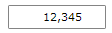
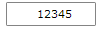

# How to Remove the Thousands Separator

By default the __RadMaskedNumericInput__ and __RadMaskedCurrencyInput__ controls use a culture-aware thousands separator:

__Example 1: AutoFillNumberGroupSeparators set to true which is by default__
```XAML
	<telerik:RadMaskedNumericInput HorizontalAlignment="Center"
								   Culture="en-US"
								   EmptyContent="Enter digits"
								   Mask="#9.0"
								   SelectionOnFocus="SelectAll"
								   SpinMode="PositionAndValue"
								   TextMode="PlainText"
								   UpdateValueEvent="LostFocus"
								   Value="12345" />
```



If you need to remove the thousands separator, you can set the __AutoFillNumberGroupSeparator__ property to __False__:

__Example 2: Setting the AutoFillNumberGroupSeparators property to false__
```XAML
	<telerik:RadMaskedNumericInput HorizontalAlignment="Center"
								   AutoFillNumberGroupSeparators="False"
								   Culture="en-US"
								   EmptyContent="Enter digits"
								   Mask="#9.0"
								   SelectionOnFocus="SelectAll"
								   SpinMode="PositionAndValue"
								   TextMode="PlainText"
								   UpdateValueEvent="LostFocus"
								   Value="12345" />
```

