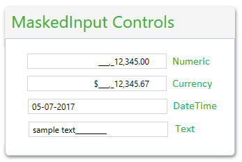

# Overview




__RadMaskedInput__ controls allow controlled data input in SilverlightWPF applications. They enhance the functionality of a TextBox by adding input validation and masks, such as date, IP Address, SSN, phone number, digits, currency and decimals.				

## Key Features

This is a list with short descriptions of the top-of-the-line features of Telerik's __RadMaskedInput__ controls.

* __Rich set of mask tokens__: The masked input controls allows you to define a mask rule that restricts the entered value. You can find more about this and the available tokens in the [Mask Tokens]() article.

* __Validation__: RadMaskedInput controls use a mask to distinguish between proper and improper user input. Read more about this in the [Validation]() section.

* __Text Input__: You can use the [RadMaskedTextInput]() control which supports restriction of the user input to customized text formats.

* __DateTime Input__: You can use the  [RadMaskedDateTimeInput]() control which ensures that the date entered by the user is verified and accurate. You can also specify the culture information by setting the __Culture__ property.

* __Numeric Input__: You can use the [RadMaskedNumericInput]() control which supports restricting the user input to decimal, fixed-point, percent and currency values, where currency values are also culture sensitive.

* __Currency Input__: You can use the [RadMaskedCurrencyInput]() control which allows broad customization of culture-aware currency values.

* __Keyboard Support__:  In addition to the standard keyboard input, the RadMaskedInput controls deliver the convenience of desktop applications with support for arrow-key [navigation]().

* __Globalization Support__: Full [globalization support]() is provided out-of-the-box through the __Culture__ property of the __RadMaskedInput__ controls.

* __Undo/Redo Support__: All RadMaskedInput controls support Undo/Redo operations. You can simply press the Ctrl+Z / Ctrl+Y key combination to take advantage of this feature.

>tip Get started with the control with its [Getting Started]() help article that shows how to use it in a basic scenario.

>Check out the control demos at [demos.telerik.com](http://demos.telerik.com/silverlight/#MaskedInput/FirstLook)[demos.telerik.com](http://demos.telerik.com/wpf/)

## See Also

 * [GettingStarted]()
 * [MaskedInputExtensions]()
 * [Placeholder]()
 * [Watermark]()
