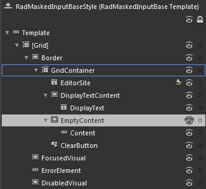

# Template Structure

Like most SilverlightWPF controls, the __RadMaskedInput__ controls also allow you to template them in order to change the control from the inside. Except for templating a whole control, you can template only parts of it or even independent controls related to it. The style of each __RadMaskedInput__ controls is based on a __RadMaskedInputBaseStyle__. This topic will make you familiar with the structure of the __RadMaskedInputBase___ templates. 

## RadMaskedInputBase Template

Here is a snapshot of the template generated in Expression Blend.

* __[Grid]__ - hosts the elements of the __RadMaskedInputBase__template and is of type __Grid__. 

* __[Border]__ - represents the outer border of the RadMaskedInput controls and is of type __Border__

* __GridContainer__ - hosts the functional parts of the __RadMaskedInput__ controls

* __EditorSite__ - represents a text box that implements the masking behavior while editing the __RadMaskedInput__ control __Value__ and is of type __PreviewInputTextBox__

* __DisplayTextContent -__hosts the content of the __RadMaskedInput__ control when the control isn't focused and is of type __Border__.

* __DisplayText -__represents a text box that is visible when the __RadMaskedInput__ control isn't focused and is of type __PreviewInputTextBox__

* __EmptyContent__ - hosts the elements that get displayed when the content of the __DisplayText__is empty and is of type __Border__.

* __Content__ - represents the content of the __RadMaskedInput__ when the __DisplayText__is empty, and is of type __ContentControl__.

* __ClearButton__- represent the Clear Button and is of type __RadButton__.

* __FocusedVisual__ - represents the visual element, that appears when the __RadMaskedInput__ control gets focused, and is of type __Border__.

* __ErrorElement__- represent the tooltip that appears when the content of the__DisplayText__is invalid and is of type __ValidationTooltip__.

* __DisabledVisual__ - represents the visual element, that appears when the __RadMaskedInput__ control is disabled, and is of type __Border__.

# See Also

 * [Getting Started]()

 * [Common Features]()
