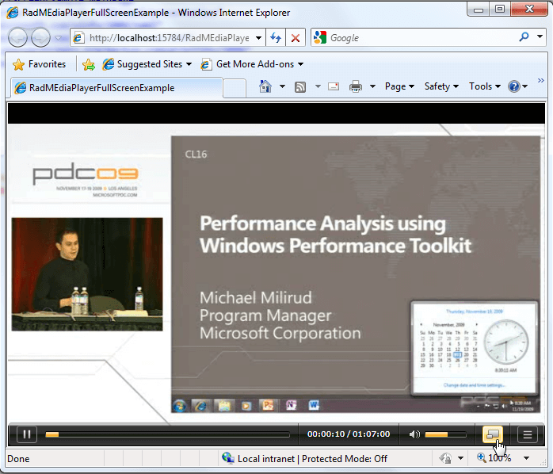

# Fullscreen

__RadMediaPlayer__ allows you to display the media content in fullscreen mode by internally changing the application fullscreen mode. You can easily toggle the mode by pressing the __FullScreen__ button or changing the __IsFullScreen__ property.

However, you should keep in mind that the fullscreen mode can only be entered after a user triggered action.

#### __XAML__

{{region radmediaplayer-fullscreen_0}}
	<telerik:RadMediaPlayer x:Name="radMediaPlayer">
	 <telerik:RadMediaItem Source="http://ecn.channel9.msdn.com/o9/pdc09/wmv/CL16.wmv"
	                       Header="Optimizing for Performance with the Windows Performance Toolkit"/>
	</telerik:RadMediaPlayer>
{{endregion}}

Since the fullscreen functionality may be application dependant, you could customize it by handling the __FullScreenChanged__ event, that is raised when the __RadMediaPlayer__ changes its fullscreen mode.

#### __XAML__

{{region radmediaplayer-fullscreen_1}}
	<telerik:RadMediaPlayer x:Name="radMediaPlayer" FullScreenChanged="radMediaPlayer_FullScreenChanged">
	 <telerik:RadMediaItem Source="http://ecn.channel9.msdn.com/o9/pdc09/wmv/CL16.wmv"
	                       Header="Optimizing for Performance with the Windows Performance Toolkit" />
	</telerik:RadMediaPlayer>
{{endregion}}

In the code-behind file you need to implement the event handler.

#### __C#__

{{region radmediaplayer-fullscreen_2}}
	private void RadMediaPlayer_FullScreenChanged(object sender, EventArgs e)
	{
	 //implement your custom logic
	}
{{endregion}}

#### __VB.NET__

{{region radmediaplayer-fullscreen_3}}
	Private Sub RadMediaPlayer_FullScreenChanged(sender As Object, e As EventArgs)
		'implement your custom logic'
	End Sub
{{endregion}}