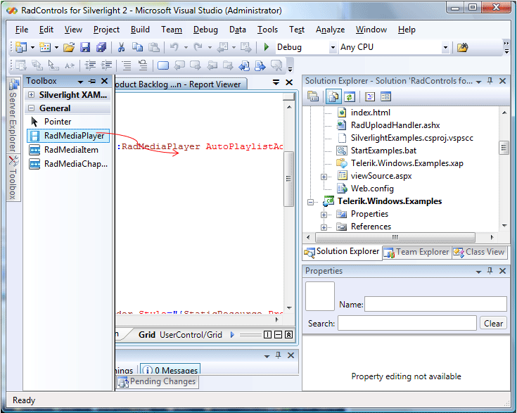

# Getting Started

This article will show you how to create a simple MediaPlayer.

> In order to use __RadMediaPlayer__ in your projects you have to add references to the following assemblies: 
>	- __Telerik.Windows.Controls__
>	- __Telerik.Windows.Controls.MediaPlayer__



You can find more info [here](http://www.telerik.com/help/wpf/installation-installing-controls-dependencies-wpf.html).





You can find more info [here](http://www.telerik.com/help/silverlight/installation-installing-controls-dependencies.html).



1. Drag and Drop the MediaPlayer control from the toolbox. 

	

2. After you have dropped the control onto the design surface, you can modify it by setting various properties:
	#### __XAML__

	{{region radmediaplayer-populating_0}}
		xmlns:telerik=http://schemas.telerik.com/2008/xaml/presentation
		...
		<telerik:RadMediaPlayer IsAutoPlaylistAdvance="True" MinWidth="200" SelectedIndex="0">
		</telerik:RadMediaPlayer>
	{{endregion}}
	
>The __RadMediaPlayer__ is a wrapper around the [Silverlight's MediaElement control](http://msdn.microsoft.com/en-us/library/system.windows.controls.mediaelement%28VS.95%29.aspx). This is why it only supports the media formats that the __Silverlight's MediaElement__ does. The full list of supported media formats can be found [here](http://msdn.microsoft.com/en-us/library/cc189080%28VS.95%29.aspx).		

The __RadMediaPlayer__ control can be populated with items of type __RadMediaItem.__ Each media item represents a resource (file or stream) that can be played by the __RadMediaPlayer__ control. Below is an example demonstrating how to declaratively add an item in XAML:

#### __XAML__

{{region radmediaplayer-populating_1}}
	<telerik:RadMediaPlayer Width="600" Height="400" Margin="20">
		<telerik:RadMediaItem 
			Source="http://mschnlnine.vo.llnwd.net/d1/ch9/7/1/5/1/2/4/DynamicsDuoCRMSilverlight_ch9.wmv"
			Header="The Dynamics Duo talk about CRM and Silverlight" />
	</telerik:RadMediaPlayer>
{{endregion}}