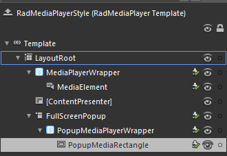
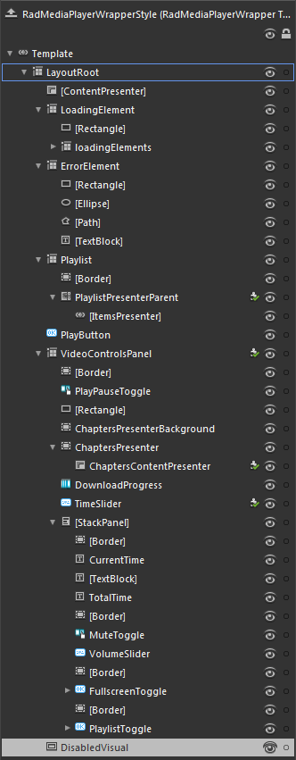

# RadMediaPlayer Template Structure

This topic will explain you the structure of the __RadMediaPlayer__ template and will describe the elements in it.

## RadMediaPlayer ControlTemplate Structure

* __LayoutRoot -__ a __Grid__ control that represents the main layout control in the __RadMediaPlayer's__ template.				
	* __MediaPlayerWrapper__ - a __RadMediaPlayerWrapper__ control that hosts the main elements of the __RadMediaPlayer__ control
		* __MediaElement__ - a __MediaElement__ control that plays the media content of the __RadMediaPlayer__

	* __[ContentPresenter]__ - a __ContentPresenter__ control that represents the __Header__ of the __RadMediaPlayer__
	* __FullScreenPopup__ - a __Popup__ control that hosts the __RadMediaPlayer__ template elements, when the control is in __FullScreen__ mode 
		* __PopupMediaPlayerWrapper__ - a __RadMediaPlayerWrapper__ control that hosts the main elements of the __RadMediaPlayer__ when the control is in __FullScreen__ mode
		* __PopupMediaRectangle__ - a __Rectangle__ control that is painted with the media content of the __RadMediaPlayer__

## RadMediaPlayerWrapper ControlTemplate Structure

* __LayoutRoot -__ a __Grid__ control that represents the main layout control in the __RadMediaPlayerWrapper's__ template.
	* __[ContentPresenter]__ - a __ContentPresenter__ control that represents the content of the __RadMediaPlayerWrapper__
	* __LoadingElement__ - a __Grid__ control that hosts the elements of the __RadMediaPlayer__ that are displayed while the media content of the control is loading
		* __[Rectangle]__ - a __Rectangle__ control that represents the background of the __LoadingElement__ content 
		* __loadingElements__ - a __Grid__ that hosts the __Ellipse__ controls which represent the loading elements that is displayed while the media content of the __RadMediaPlayer__ is loading
	* __ErrorElement__ - a __Grid__ control that hosts the controls that are displayed when the media content cannot be loaded
		* __[Rectangle]__ - a __Reactangle__ control that represents the background of the __ErrorElement__ content
		* __[Ellipse]__ - an __Ellipse__ control that is displayed when the media content cannot be loaded
		* __[Path]__ - a __Path__ control that is displayed when the media content cannot be loaded
		* __[TextBlock]__ - a __TextBlock__ control that displays a notification when the media content cannot be loaded
	* __Playlist__ - a __Grid__ control that hosts the __RadMediaPlayer__ Playlist elements
		* __[Border]__ - a __Border__ control that represents the  __RadMediaPlayer__  Playlist border and background
		* __PlaylistPresenterParent__ - a __ScrollViewer__ that hosts the __RadMediaPlayer__  Playlist items
			* __[ItemsPresenter]__ - an __ItemsPresenter__ control used to display the __RadMediaPlayer__  Playlist items
	* __PlayButton__ - a __RadButton__ control the represents the main PlayButton
	* __VideoControlsPanel__ - a __Grid__ control that hosts the video controls of the __RadMediaPlayer__
		* __[Border]__ - a __Border__ control that represents the border and the background of the __RadMediaPlayer__ video controls
		* __PlayPauseToggle__ - a __RadToggleButton__ control that represents a button to start and pause the media content
		* __[Rectangle]__ - a __Rectangle__ control that represents the outer border and background of the __RadMediaPlayer__ timeline 
		* __ChaptersPresenterBackground__ - a __Border__ that represents the border and the background of the __RadMediaPlayer__ chapters
		* __ChaptersPresenter__ - a __Border__ control that hosts the __RadMediaPlayer__ chapters
			* __ChaptersContentPresenter__ - a __ContentPresenter__ control that hosts the __RadMediaPlayer__ chapters
		* __DownloadProgress__ - a __RadProgressBar__ control that displayes the download progress of the media content
		* __TimeSlider__ - a __RadSlider__ control that represents the __RadMediaPlayer__ timeline
		* __[StackPanel]__ - a __StackPanel__ control that hosts the __RadMediaPlayer__ video controls
			* __[Border]__ - a __Border__ control that represents a separator between the video controls
			* __CurrentTime__ - a __TextBlock__ control that displayes the current time progress of the media content
			* __[TextBlock]__ - a __TextBlock__ control that displayes '/'
			* __TotalTime__ - a __TextBlock__ control that displayes the total time of the media content
			* __[Border]__ - a __Border__ control that represents a separator between the video controls
			* __MuteToggle__- a __RadToggleButton__ control that represents a button to mute the audio of the media content
			* __VolumeSlider__ - a __RadSlider__ control that represents the volume slider of the __RadMediaPlayer__
			* __[Border]__ - a __Border__ control that represents a separator between the video controls
			* __FullscreenToggle__ - a __RadButton__ control that represents a button to toggle the FullScreen mode of the __RadMediaPlayer__
			* __[Border]__ - a __Border__ control that represents a separator between the video controls
			* __PlaylistToggle__ - a __RadButton__ control that represents a button to toggle the visibility of the __RadMediaPlayer__ playlist
	* __DisabledVisual__ - a __Rectangle__ control that is displayed when the __RadMediaPlayer__ is disabled
