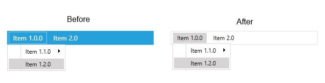

# Backwards Compatibility

Required introduction

## Q3 2013

__Changed__

* The __background__ color of the RadMenu in __Windows8Theme__ has been made transparent. The next figure shows the change:
                      

                              Figure 2. Changes to the Windows8Theme Background color from Q2 2013 to Q3 2013.
                          

__What to do now:__

In order to customize the current version of the control to look exactly as it was before the above change you will need to customize the __RadManuStyle__ and __RadMenuItemStyle__. You can find a runnable project that contains all of the necessary customizations in our online SDK repository
                  [here](https://github.com/telerik/xaml-sdk/tree/master/Menu/OldMenuAndItemStyle). You can download the entire repository as a zip file via
                  [this](https://github.com/telerik/xaml-sdk/archive/master.zip) link.
              
