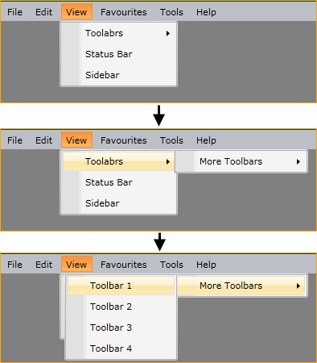

# Boundaries Detection

When you continuously open sub-menu items, you might face the situation when there is not enough space to open the next menu item. The __RadMenu__ control comes with a boundary detection functionality out of the box. This means that the __RadMenu__ detects the Silverlight plug-in's boundaries and opens the child items in the opposite direction when the screen boundaries are to be crossed. When there is not enough space in both directions, the control will adjust its items' position to make them visible wherever possible.        

The following table demonstrates __RadMenu__ dropdown behavior when encounters a screen edge:

DropDownPlacement	|	Top Edge	|	Bottom Edge	|	Left Edge	|	Right Edge
---	|	---	|	---	|	---	|	---
Top	|	The target origin changes to the bottom-left corner of the target area and the popup alignment point changes to the top-left corner of the RadMenu. In effect, this is the same as when Placement is Bottom.	|	Aligns to the bottom edge.	|	Aligns to the left edge.	|	Aligns to the right edge.
Bottom	|	Aligns to the top edge.	|	The target origin changes to the top-left corner of the target area and the popup alignment point changes to the bottom-left corner of the RadMenu.	|	Aligns to the left edge.	|	Aligns to the right edge.
Left	|	Aligns to the top edge.	|	Aligns to the bottom edge.	|	The target origin changes to the top-right corner of the target area and the popup alignment point changes to the top-left corner of the RadMenu.	|	Aligns to the right edge.
Right	|	Aligns to the top edge.	|	Aligns to the bottom edge.	|	Aligns to the left edge.	|	The target origin changes to the top-left corner of the target area and the popup alignment point changes to the top-right corner of the RadMenu.

## See Also

 * [Visual Structure]()

 * [Orientation and DropDownPlacement]()

 * [Keyboard Navigation]()
