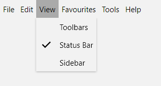
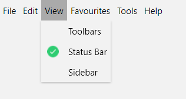

# Checkable Items

In order to enhance the functionality of the __RadMenu__ control, the __RadMenuItem__ can behave like a checkable item. This means that it can be checked and unchecked like a simple __CheckBox__. In order to toggle this behavior you have to set the __IsCheckable__ property of the __RadMenuItem__ to either __True__ or __False__. The default value is __False__.

>tip To learn how to group the checkable items into radio groups read [here]().

>tip Upon checking and unchecking the respective events are raised - __Checked__ and __Unchecked__. You can subscribe to them in order to implement your custom logic against the respective action. To learn more about them read here.

Here is an example of a definition of a checkable __RadMenuItem__:

__Example 1: Define a checkable menu item__

```XAML
	<telerik:RadMenuItem Header="Status Bar" IsCheckable="True" />
```

Upon clicking on the item it will get checked and the tick will appear as an icon for the item.

>tip Note that after clicking on the item the menu will collapse. In order to keep the menu open you can set the __StaysOpenOnClick__ property of the __RadMenuItem__ to __True__. This will keep the menu open when this item is clicked.



>If you want to programmatically mark an item as checked, you have to set the __IsChecked__ property to __True__.

## Checked Icon

As of **R1 2022**, the menu items also expose **CheckedIcon** and **CheckedIconTemplate** properties which you can use to replace the default checkmark glyph with your custom icon which is used when the item is checked.

__Example 2: Using a custom check icon__

```XAML
	<telerik:RadMenuItem IsCheckable="True" Header="Status Bar" CheckedIconTemplate="{x:Null}">
		<telerik:RadMenuItem.CheckedIcon>
			<Image Source="check-icon.png" Width="16" Height="16" Stretch="UniformToFill" />
		</telerik:RadMenuItem.CheckedIcon>
	</telerik:RadMenuItem>
```

>important Note that you also need to set the **CheckedIconTemplate** to **null** to override the default icon.

If you're generating the items [dynamically](), you can define the **CheckedIconTemplate** as shown in **Example 3**.

__Example 3: Setting the checked icon for dynamically generated items__

```XAML
    <!-- If you are using the NoXaml binaries, you need to base the style on the default one for the theme like so:  
    <Style TargetType="telerik:RadMenuItem" BasedOn="{StaticResource RadMenuItemStyle}"> -->  
 
    <Style x:Key="MenuItemStyle" TargetType="telerik:RadMenuItem"> 
        <!-- ... --> 
        <Setter Property="CheckedIcon" Value="{Binding CheckedIconUrl}" />
        <Setter Property="CheckedIconTemplate">
            <Setter.Value>
                <DataTemplate>
                    <Image Source="{Binding}" Width="16" Height="16" Stretch="UniformToFill"/>
                </DataTemplate>
            </Setter.Value>
        </Setter>
    </Style>
```



## See Also

 * [Icons]()

 * [Separator Items]()

 * [Group Checkable Menu Items into Radio Group]()
