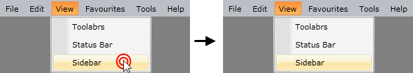

# Click Modes

By default if an item in the __RadMenu__ control is clicked, the menu gets closed. You are able to control this behavior by setting the __StaysOpenOnClick__ property of the __RadMenuItem__. The default value is __False__.

If you set this property to __True__, the menu won't get closed upon a click on the item.


```XAML
	<telerik:RadMenuItem Header="Sidebar"
	             StaysOpenOnClick="True" />
```



>tip You might find this functionality very useful, when having checkable menu items in your __RadMenu__. It allows you to keep the menu open, when a menu item gets checked. To learn more about this type of items read [here]().

## See Also

 * [Opening Modes]()

 * [Opening and Closing Delays]()

 * [Events - Overview]()
