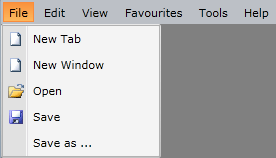

# Icons

The __RadMenu__ allows you to display an icon for each of the menu items. This can be done by setting the __Icon__ property of the __RadMenuItem__. For the icon to be displayed as expected, you have to either provide an element of type __Image__ for it or also set the **IconTemplate** property of the item.

## Setting the Icon of a Static Item

>tipTo learn more about this way of populating the __RadMenu__ with static data take a look at the [Using Static Items]() topic.

When using static items you can directly access the __Icon__ property of each item. Respectively you can set it directly:

__Example 1: Setting the Icon property declaratively__

```XAML
	<telerik:RadMenuItem Header="New File">
	    <telerik:RadMenuItem.Icon>
	        <Image Source="/Images/newFile.png" 
	               Stretch="UniformToFill" />
	    </telerik:RadMenuItem.Icon>
	</telerik:RadMenuItem>
```

**Figure 1** illustrates the resulting items.

#### Figure 1: RadMenuItems with their Icon property set



## Setting the Icon of a Dynamic Item

>tipTo learn more about this way of populating the __RadMenu__ with dynamic data take a look at the [Binding to Dynamic Data]() topic.

When using dynamic items, you have to bind the __Icon__ property to a property of the data item. The specific here is that your data item needs to either expose a property of type __Image__, so the __Icon__ property can be bound properly or you need to define the **IconTemplate** property of the menu items if you wish to bind it to a **string** or **Uri**, for example.

Let's assume you've defined the following class which exposes the icon Uri as well as a read-only property which returns an image from this Uri.

__Example 2: MenuItem class with Uri and Image properties__

```C#
	public class MenuItem
	{
	    //...
	
	    public Uri IconUrl
	    {
	        get;
	        set;
	    }
	
	    public Image Icon
	    {
	        get
	        {
	            return new Image()
	            {
	                Source = new BitmapImage(this.IconUrl)
	            };
	        }
	    }
	
	    //...
	}
```
```VB.NET
	Public Class MenuItem
	    '...
	    Public Property IconUrl() As Uri
	        Get
	        End Get
	        Set(value As Uri)
	        End Set
	    End Property
	    Public ReadOnly Property Icon() As Image
	        Get
	            Dim img As New Image()
	            img.Source = New BitmapImage(Me.IconUrl)
	            Return img
	        End Get
	    End Property
	    '...
	End Class
```

You can then bind the Icon using any of the two properties. Following the example from the [Binding to Dynamic Data]() article, you can add the following setters to **ItemContainerStyle**.

* If you wish to bind directly to a property of type Image:

	__Example 2: Setting the Icon property to an Image__

	```XAML
		<!-- If you are using the NoXaml binaries, you will have to base the style on the default one for the theme like so: 
		<Style TargetType="telerik:RadMenuItem" BasedOn="{StaticResource RadMenuItemStyle}">--> 
		
		<Style x:Key="MenuItemStyle" TargetType="telerik:RadMenuItem">
			<!-- ... -->
			<Setter Property="Icon" Value="{Binding Icon}" />
		</Style>
	```

* If you wish to bind directly to a property of type Uri/string:

	__Example 3: Setting the Icon property to an Uri/string__

	```XAML
		<!-- If you are using the NoXaml binaries, you will have to base the style on the default one for the theme like so: 
		<Style TargetType="telerik:RadMenuItem" BasedOn="{StaticResource RadMenuItemStyle}">--> 

        <Style x:Key="MenuItemStyle" TargetType="telerik:RadMenuItem">
			<!-- ... -->
            <Setter Property="Icon" Value="{Binding IconUrl}" />
            <Setter Property="IconTemplate" >
                <Setter.Value>
                    <DataTemplate>
                        <Image Source="{Binding}" Stretch="UniformToFill"/>
                    </DataTemplate>
                </Setter.Value>
            </Setter>
        </Style>
	```

<!-- -->

Both approaches will lead to the same results as when you set the icon declaratively.

#### Figure 2: Dynamic RadMenuItems with their icons


## See Also

* [Checkable Items]()
* [Binding to Dynamic Data]()
* [Commands]()