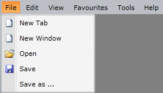
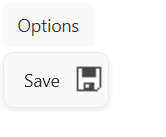

# Icons

The `RadMenu` allows you to display an icon for each of the menu items. This can be done by setting the `Icon` property of the `RadMenuItem`. For the icon to be displayed as expected, you have to either provide an element of type `Image` for it or also set the `IconTemplate` property of the item.

## Setting the Icon of a Static Item

>tip To learn more about this way of populating the RadMenu with static data take a look at the [Using Static Items]() topic.

When using static items you can directly access the Icon property of each item. Respectively you can set it directly:

__Setting the Icon property declaratively__
<snippet id='radmenu-features-icons-block_1-xaml' />

__RadMenuItems with their Icon property set__

## Setting the Icon of a Dynamic Item

>tip To learn more about this way of populating the RadMenu with dynamic data take a look at the [Binding to Dynamic Data]() topic.

When using dynamic items, you have to bind the Icon property to a property of the data item. The specific here is that your data item needs to either expose a property of type Image, so the Icon property can be bound properly or you need to define the IconTemplate property of the menu items if you wish to bind it to a `string` or `Uri`, for example.

Let's assume you've defined the following class which exposes the icon Uri as well as a read-only property which returns an image from this Uri.

__MenuItem class with Uri and Image properties__
<snippet id='radmenu-features-icons-block_2-cs' />
<snippet id='radmenu-features-icons-block_2-vb' />

You can then bind the Icon using any of the two properties. Following the example from the [Binding to Dynamic Data]() article, you can add the following setters to `ItemContainerStyle`.

* If you wish to bind directly to a property of type Image:

	__Setting the Icon property to an Image__
	<snippet id='radmenu-features-icons-block_3-xaml' />

* If you wish to bind directly to a property of type Uri/string:

	__Setting the Icon property to an Uri/string__
	<snippet id='radmenu-features-icons-block_4-xaml' />

<!-- -->

Both approaches will lead to the same results as when you set the icon declaratively.

__Dynamic RadMenuItems with their icons__

## Setting the Icon Position

The `RadMenuItem` element exposes the `ItemIconPosition` property that allows for specifying the location of the icon. It is of the type of `ItemIconPosition`, which exposes the following two options:

* `Left`&mdash;The icon will be displayed on the left side of the RadMenuItem's content. This is the default value.
* `Right`&mdash;The icon will be displayed on the right side of the RadMenuItem's content.

__Setting the ItemIconPosition property to Right__
<snippet id='radmenu-features-icons-block_5-xaml' />

__RadMenuItem with its icon positioned on the right__

## See Also

* [Checkable Items]()
* [Binding to Dynamic Data]()
* [Commands]()