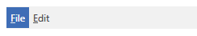

# Main Menu

As of **R3 2018**, RadMenu exposes a boolean **IsMainMenu** property which indicates whether RadMenu receives a main menu activation notification. When set to **True** and the user presses the **F10** or the **Alt** key, the menu grabs the focus and its first item gets highlighted. The default value is **False**.

#### __Figure 1: RadMenu with IsMainMenu set to True once Alt/F10 is pressed__

>If there are multiple RadMenu instances with IsMainMenu set to **True**, only one of them will get highlighted.

<!-- -->

>If the mouse is captured at the moment when the activation takes place, the RadMenu will not receive the focus.

## See Also

 * [Orientation and DropDownPlacement]()
 * [Opening Modes]()
 * [Click Modes]()