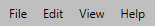
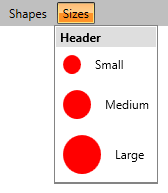
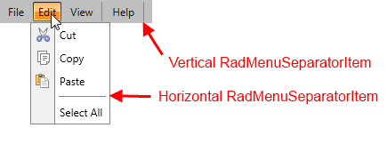

# Menu Items

In __RadMenu__ basically there are three types of menu items which provide different ways to display the data in a hierarchical structure. They are as follows:  

* [RadMenuItem](#radmenuitem)

* [RadMenuGroupItem] (#radmenugroupitem)

* [RadMenuSeparatorItem] (#radmenuseparatoritem)

## RadMenuItem

__RadMenuItem__ is the main menu item in __RadMenu__. It is used for the top-level menu and each __RadMenuItem__ can have other RadMenuItems as children in order to create sub-menus. Its __Header__ property accepts plain text as well as other objects, it can be set the following ways:       


```XAML
	<telerik:RadMenu>
	    <!--1-->
	    <telerik:RadMenuItem Header="File" />
	
	    <!--2-->
	    <telerik:RadMenuItem>
	        <telerik:RadMenuItem.Header>Edit</telerik:RadMenuItem.Header>
	    </telerik:RadMenuItem>
	
	    <!--3-->
	    <telerik:RadMenuItem>
	        <telerik:RadMenuItem.Header>
	            <TextBlock Text="View" />
	        </telerik:RadMenuItem.Header>
	    </telerik:RadMenuItem>
	    ...
	</telerik:RadMenu>
```

And here is the result:



You can also set an Icon of __RadMenuItem__ which is done by its __Icon__ property. The property accepts an object.       

>For more detailed information about setting an Icon to __RadMenuItem__, please check the [Icons]() article.

## RadMenuGroupItem

__RadMenuGroupItem__ inherits from __RadMenuItem__ class and it is used as container of a __RadMenuItem__ dropdown. In other words any UI element can be placed inside of __RadMenuGroupItem__. By default the background color of __RadMenuGroupItem__ is White and there is no Icon area with different color unlike __RadMenuItem__, so you can easily use different sized Icons in the dropdown. In addition to this __RadMenuGroupItem__ also has a __Header__ property which is displayed on the top of all the group items.


```XAML
	<telerik:RadMenu VerticalAlignment="Top">
	    <telerik:RadMenuItem Header="Shapes" />
	    <telerik:RadMenuItem Header="Sizes">
	        <telerik:RadMenuGroupItem Header="Header">
	            <telerik:RadMenuItem Header="Small" IconTemplate="{StaticResource IconTemplate}" IconColumnWidth="35" Height="35" />
	            <telerik:RadMenuItem Header="Medium" IconTemplate="{StaticResource IconTemplate}" IconColumnWidth="45" Height="45" />
	            <telerik:RadMenuItem Header="Large" IconTemplate="{StaticResource IconTemplate}" IconColumnWidth="55" Height="55" />
	        </telerik:RadMenuGroupItem>
	    </telerik:RadMenuItem>
	</telerik:RadMenu>
```

And this is the result:



## RadMenuSeparatorItem

__RadMenuSeparatorItem__ also inherits from __RadMenuItem__. It is a menu item used to separate __RadMenuItems__/__RadMenuGroupItems__. Its orientation can be horizontal and vertical and it is automatically set depending on the menu orientation.


```XAML
	<telerik:RadMenu>
	    ...
	    <telerik:RadMenuSeparatorItem />
	    ...
	</telerik:RadMenu>
```



## See Also

 * [Icons]()

 * [Orientation and DropDownPlacement]()

 * [Checkable Items]()

 * [Commands]()