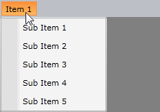
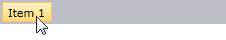
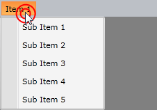

# Opening Modes

If a menu item in the __RadMenu__ control contains any children, they are shown depending on a user action. There are two opening modes that recognize the following two actions:

* The child items are shown when the mouse is over the parent.

* The child items are shown when the user clicks on the parent.

This behavior of the __RadMenu__ control can be controlled via the __ClickToOpen__ property. The default value is __False__ which means that the child items are displayed upon a hover action.



Setting the property to __True__ will make the child items appear upon a mouse click on their parent. Note that the children do not automatically hide,  but they will wait for a mouse click again.


```XAML
	<telerik:RadMenu ClickToOpen="True">
	    ...
	</telerik:RadMenu>
```

To illustrate this case here is a snapshot of the menu upon a hover:



and upon a mouse click:



## See Also

 * [Opening and Closing Delays]()

 * [Orientation and DropDownPlacement]()

 * [Click Modes]()
