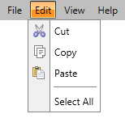
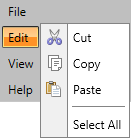
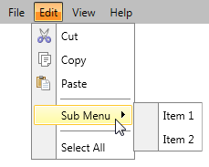

# Orientation and DropDownPlacement

The __RadMenu__ exposes a set of properties, which allow you to specify its orientation and placement of the drop-down sub-menus. They are as follows:

* [Orientation](#orientation)

* [DropDownPlacement](#dropdownplacement)

## Orientation

The __RadMenu__ control can have its layout oriented in two directions - horizontal and vertical (similar to the __StackPanel__). By default the top-level items of the __RadMenu__ are ordered __horizontally__. 



>Note that the sub menu items are not connected to the orientation of the __RadMenu__ control.

To modify the orientation you just have to set the __Orientation__ property to one of the following values:

* __Horizontal__ (default)

* __Vertical__

Here is an example of a __vertically__ oriented __RadMenu.__

#### __XAML__

```XAML
	<telerik:RadMenu Orientation="Vertical">
	    ...
	</telerik:RadMenu>
```



## DropDownPlacement

If there are any sub-menus in the __RadMenu__ their dropdown position can be specified through the __DropDownPlacement__ property of the __RadMenuItem__. It has the following values:

* __Auto__ - positions the dropdown of the sub-menu automatically.

* __Bottom__ - displays the nested __RadMenuItems__ below the parent RadMenuItem.

* __Left__ - displays the nested __RadMenuItems__ on the left of the parent RadMenuItem.

* __Right__ - displays the nested __RadMenuItems__ on the right of the parent RadMenuItem.

* __Top__ - displays the nested __RadMenuItems__ above the parent RadMenuItem.

Here is an example:

#### __XAML__

```XAML
	<telerik:RadMenu>
	    ...
	    <telerik:RadMenuItem Header="Edit" DropDownPlacement="Bottom">
	        ...
	        <telerik:RadMenuItem Header="Sub Menu" DropDownPlacement="Right">
	            <telerik:RadMenuItem Header="Item 1" />
	            <telerik:RadMenuItem Header="Item 2" />
	        </telerik:RadMenuItem>
	        ...
	    </telerik:RadMenuItem>
	    ...
	</telerik:RadMenu>
```



## See Also

 * [Opening Modes]()

 * [Click Modes]()

 * [Opening and Closing Delays]()
