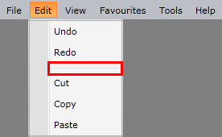

# Separator Items

To show separators between the menu items, you can use the `RadMenuSeparatorItem` element. Its orientation can be horizontal and vertical and it is automatically set depending on the menu orientation.

#### __[XAML]__
{{region radmenu-features-separator-items-0}}
	<telerik:RadMenu> 
	    <!-- other items here --> 
	    <telerik:RadMenuSeparatorItem /> 
	    <!-- other items here -->
	</telerik:RadMenu> 
{{endregion}}

 
## See Also  
 * [Checkable Items]()  
 * [Icons]()
 * [Group Checkable Menu Items into Radio Group]()
