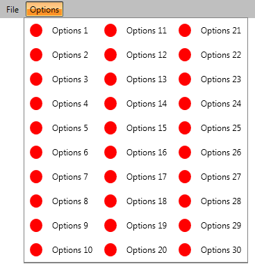

# Create Multicolumn Menu

The default arrangement of the items in the Popup of __RadMenuItem__/__RadMenuGroupItem__ is in vertical stack. This is because the __ItemsPanel__ of __RadMenuItem__/__RadMenuGroupItem__ is a vertically oriented __StackPanel__. In order to achieve a different layouting of the sub items you have to change the panel, for this scenario you can use either __RadWrapPanel__ or __RadUniformGrid__.        

We are going to use a __RadMenuGroupItem__ for the dropdown and set an IconTemplate to every __RadMenuItem__ inside of it. So at first we create a __Style__ that targets the __RadMenuGroupItem__ and in it sets the __ItemsPanel__ property to the desired value (in this case a vertically oriented __RadWrapPanel__ with maximum height of 350).

#### __XAML__

```XAML
	<Style x:Key="MultiColumnMenuItemStyle" TargetType="telerik:RadMenuGroupItem">
	    <Setter Property="ItemsPanel">
	        <Setter.Value>
	            <ItemsPanelTemplate >
	                <telerik:RadWrapPanel MaxHeight="350" Orientation="Vertical" />
	            </ItemsPanelTemplate>
	        </Setter.Value>
	    </Setter>
	</Style>
```

Apply the created style to the __RadMenuGroupItem__ items by setting it to the __ItemContainerStyle__ property of the desired top-level __RadMenuItem__.

#### __XAML__

```XAML
	<telerik:RadMenu>
	    <telerik:RadMenuItem Header="File" />
	    <telerik:RadMenuItem Header="Options" ItemContainerStyle="{StaticResource MultiColumnMenuItemStyle}">
	        <telerik:RadMenuGroupItem>
	            <telerik:RadMenuItem Header="Options 1" IconTemplate="{StaticResource IconTemplate}" IconColumnWidth="35" Height="35" />
	            <telerik:RadMenuItem Header="Options 2" IconTemplate="{StaticResource IconTemplate}" IconColumnWidth="35" Height="35" />
	            <!-- More Menu Items -->
	            <telerik:RadMenuItem Header="Options 30" IconTemplate="{StaticResource IconTemplate}" IconColumnWidth="35" Height="35" />
	        </telerik:RadMenuGroupItem>
	    </telerik:RadMenuItem>
	</telerik:RadMenu>
```

Here is a snapshot of the result.



## See Also

 * [Using Static Items]()

 * [Binding to Dynamic Data]()

 * [Visual Structure]()
