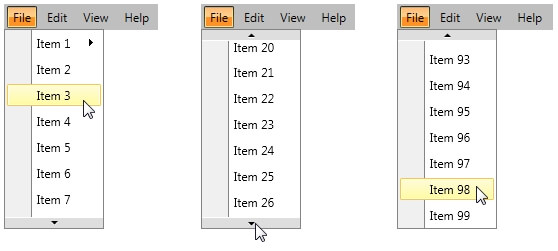
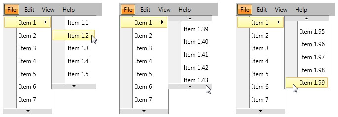
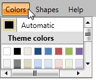

# Create Scrollable Menus

A scrolling functionality can be added to a RadMenu which displays a long list of items or the number of the visible items should be limited. The process to do that is very simple and straightforward. This article will demonstrate the process.      

## Use DropDownHeight property      

Each __RadMenuItem__ has __DropDownHeight__ property. The value of the property shows the height of RadMenuItem's submenu. If you set it, but the submenu __RadMenuItems__ don't fit in this size, you will see two buttons which can be used to scroll through your collection:



The property can be set to any nested submenu __RadMenuItem__ in order to control the height of its content:



Here's a simple code that shows how to use the __DropDownHeight__ property:


```XAML
	<telerik:RadMenu x:Name="Menu">
	    <telerik:RadMenuItem Header="File" DropDownHeight="200">
	        <telerik:RadMenuItem Header="Item 1" DropDownHeight="150">
	            <telerik:RadMenuItem Header="Item 1.1"/>
	            <telerik:RadMenuItem Header="Item 1.2"/>
	            <!--Define all items -->
	        </telerik:RadMenuItem>
	        <telerik:RadMenuItem Header="Item 2" />
	        <!--Define all items -->
	    </telerik:RadMenuItem>
	</telerik:RadMenu>
```

## Scrolling in RadMenuGroupItem      

If you are using __RadMenuGroupItem__ you can control the scrolling inside via ScrollViewer's attached properties - VerticalScrollBarVisibility and HorizontalScrollBarVisibility.


```XAML
	<telerik:RadMenu>
	    <telerik:RadMenuItem Header="Colors">
	        <telerik:RadMenuGroupItem Height="100" Width="150" ScrollViewer.HorizontalScrollBarVisibility="Visible" ScrollViewer.VerticalScrollBarVisibility="Visible">
	            <telerik:RadColorSelector/>
	        </telerik:RadMenuGroupItem>
	    </telerik:RadMenuItem>
	</telerik:RadMenu>
```



## See Also

 * [Visual Structure]()