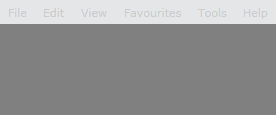
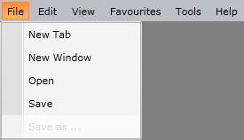

# Enable and Disable Menu Items

This topic will show you how to enable and disable menu items. There are several major cases that will serve as examples:

* Disable all menu items

* Disable a static menu item

* Disable a dynamic menu item

## Disable all Menu Items

Disabling all menu items can be easily done by just setting the __IsEnabled__ property of the __RadMenu__ parent control to __False__.


```XAML
	<telerik:RadMenu VerticalAlignment="Top" IsEnabled="False">
	</telerik:RadMenu>
```

This will disable the top-level menu items and they won't be expandable. 



## Disable a Static Menu Item

To disable a static menu item you just have to set its __IsEnabled__ property to __False__.


```XAML
	<telerik:RadMenuItem Header="Save as ..." IsEnabled="False" />
```

>Note that disabling an item will prevent it from expanding its child items (if any).



## Disable a Dynamic Menu Item

>tip Before you continue reading this topic, you might find useful to take a look at the [Binding to Dynamic Data]() topic.

In order to disable a dynamic menu item you have to bind its __IsEnabled__ property to the appropriate boolean property of your data item. To do this you can set the ItemContainerStyle property of RadMenu.


```XAML
	<telerik:RadMenu>
	    <telerik:RadMenu.ItemContainerStyle>
			<!-- if you use NoXaml dlls, set the following property on the Style object: BasedOn="{StaticResource RadMenuItemStyle}" -->
	        <Style TargetType="telerik:RadMenuItem">
				<Setter Property="IsEnabled" Value="{Binding CanClickItem}" />
	        </Style>
	    </telerik:RadMenu.ItemContainerStyle>
	</telerik:RadMenu>
```

## See Also  
 * [Checkable Items]()
 * [Separator Items]()
 * [Commands]()