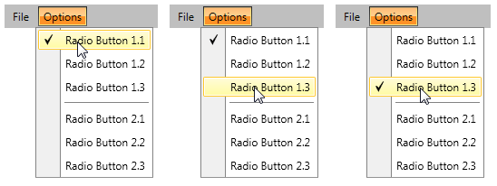

# Group Checkable Menu Items into Radio Group

This tutorial will show you how to group your checkable menu items into a radio group. This will allow you to have only one of them checked at a time.

## Creating a sample RadMenu and defining the Radio Groups

Here is a sample __RadMenu__ and one of its items has two radio groups. Notice that the __Tag__ property of the __RadMenuItem__ is used to store the name of the Radio Group. In this case the groups are named "1" and "2".        


```XAML
	<telerik:RadMenu x:Name="radMenu">
	    <telerik:RadMenuItem Header="File">
	        <telerik:RadMenuItem Header="Exit" />
	    </telerik:RadMenuItem>
	    <telerik:RadMenuItem Header="Options">
	        <telerik:RadMenuItem Header="Radio Button 1.1"
	                             Tag="1"
	                             IsCheckable="True"
	                             StaysOpenOnClick="True" />
	        <telerik:RadMenuItem Header="Radio Button 1.2"
	                             Tag="1"
	                             IsCheckable="True"
	                             StaysOpenOnClick="True" />
	        <telerik:RadMenuItem Header="Radio Button 1.3"
	                             Tag="1"
	                             IsCheckable="True"
	                             StaysOpenOnClick="True" />
	        <telerik:RadMenuItem IsSeparator="True" />
	        <telerik:RadMenuItem Header="Radio Button 2.1"
	                             Tag="2"
	                             IsCheckable="True"
	                             StaysOpenOnClick="True" />
	        <telerik:RadMenuItem Header="Radio Button 2.2"
	                             Tag="2"
	                             IsCheckable="True"
	                             StaysOpenOnClick="True" />
	        <telerik:RadMenuItem Header="Radio Button 2.3"
	                             Tag="2"
	                             IsCheckable="True"
	                             StaysOpenOnClick="True" />
	    </telerik:RadMenuItem>
	</telerik:RadMenu>
```

## Handling the ItemClick Event

The next step is to handle the __ItemClick__ event of the __RadMenu.__ It gets fired each time an item gets clicked __.__


```XAML
	<telerik:RadMenu x:Name="radMenu1" ItemClick="radMenu_ItemClick">
	    ...
	</telerik:RadMenu>
```

In the event handler you get the item that has been clicked and check if it is checkable or is placed in a group.


```C#
	private void radMenu_ItemClick(object sender, RadRoutedEventArgs e)
	{
	    var currentItem = e.OriginalSource as RadMenuItem;
	    if (currentItem.IsCheckable && currentItem.Tag != null)
	    {
	        //the place for the radio items logic
	    }
	}
```
```VB.NET
	Private Sub radMenu_ItemClick(sender As Object, e As RadRoutedEventArgs)
	    Dim currentItem = TryCast(e.OriginalSource, RadMenuItem)
	    If currentItem.IsCheckable AndAlso currentItem.Tag <> Nothing Then
	        'the place for the radio items logic
	    End If
	End Sub
```

The next step is to get the sibling items of the clicked one, which are from the same group.

## Getting All Sibling Items from the same Group

In order the uncheck the other items from the same group, you have to get them first. Here is a method that takes as a parameter the clicked item and returns the sibling items which are from the same group.


```C#
	private List<RadMenuItem> GetSiblingGroupItems(RadMenuItem currentItem)
	{
	    var parentItem = currentItem.ParentOfType<RadMenuItem>();
	    if (parentItem == null)
	    {
	        return null;
	    }
	    List<RadMenuItem> items = new List<RadMenuItem>();
	    foreach (var item in parentItem.Items)
	    {
	        RadMenuItem container = parentItem.ItemContainerGenerator.ContainerFromItem(item) as RadMenuItem;
	        if (container == null || container.Tag == null)
	        {
	            continue;
	        }
	        if (container.Tag.Equals(currentItem.Tag))
	        {
	            items.Add(container);
	        }
	    }
	    return items;
	}
```
```VB.NET
	Private Function GetSiblingGroupItems(currentItem As RadMenuItem) As List(Of RadMenuItem)
	    Dim parentItem = currentItem.ParentOfType(Of RadMenuItem)()
	    If parentItem Is Nothing Then
	        Return Nothing
	    End If
	    Dim items As New List(Of RadMenuItem)()
	    For Each item In parentItem.Items
	        Dim container As RadMenuItem = TryCast(parentItem.ItemContainerGenerator.ContainerFromItem(item), RadMenuItem)
	        If container Is Nothing OrElse container.Tag = Nothing Then
	            Continue For
	        End If
	        If container.Tag.Equals(currentItem.Tag) Then
	            items.Add(container)
	        End If
	    Next
	    Return items
	End Function
```

First you get the parent item of the clicked one and then you iterate through its __Items__ collection. The Items collection doesn't hold the container itself, so you have to get the container of each item and check if it belongs to the same group as the clicked item. The matching containers are returned as __List__.       

## Checking only the Clicked Item

Now as the sibling items from the same group are available, the only things that's left is to unmark those of them which are different from the clicked one as unchecked.


```C#
	private void radMenu_ItemClick(object sender, Telerik.Windows.RadRoutedEventArgs e)
	{
	    var currentItem = e.OriginalSource as RadMenuItem;
	    if (currentItem.IsCheckable && currentItem.Tag != null)
	    {
	        var siblingItems = this.GetSiblingGroupItems(currentItem);
	        if (siblingItems != null)
	        {
	            foreach (var item in siblingItems)
	            {
	                if (item != currentItem)
	                {
	                    item.IsChecked = false;
	                }
	            }
	        }
	    }
	}
```
```VB.NET
	Private Sub radMenu_ItemClick(ByVal sender As Object, ByVal e As Telerik.Windows.RadRoutedEventArgs)
	    Dim currentItem = TryCast(e.OriginalSource, RadMenuItem)
	    If currentItem.IsCheckable AndAlso currentItem.Tag IsNot Nothing Then
	        Dim siblingItems = Me.GetSiblingGroupItems(currentItem)
	        If siblingItems IsNot Nothing Then
	            For Each item In siblingItems
	                If item IsNot currentItem Then
	                    item.IsChecked = False
	                End If
	            Next item
	        End If
	    End If
	End Sub
```

## Using this Logic with Dynamic Data

>tip Before you continue, please, Take a look at the topic about [Binding to Dynamic Data]().          

>tip An entirely business object oriented approach about handling radio groups within dynamic data can be found in the [online demo](https://demos.telerik.com/silverlight/#Menu/CheckableMenuItems).          

When having __RadMenu__ with dynamic data in it, the logic remains the same, but you have to modify the data items a bit, so they can provide the needed information. You need your business object to expose several properties.        

* __Header__ - indicates header text of the item. It will be bound to the __Header__ property of the __RadMenuItem.__

* __IsCheckable__ - indicates whether the item is checkable. It will be bound to the __IsCheckable__ property of the __RadMenuItem.__

* __IsSeparator__ - indicates whether the item is a separator. It will be bound to the __IsSeparator__ property of the __RadMenuItem__.

* __RadioGroup__ - represents the radio group to which the item belongs. It will be bound to the __Tag__ property of the __RadMenuItem__.

* __SubMenuItems__ - represents a collection with the sub menu items of the item. It will be bound to the __ItemsSource__ property of the __RadMenuItem__.


```C#
	public class MenuItem
	{
	    public string Header { get; set; }
	    public bool IsCheckable { get; set; }
	    public string RadioGroup { get; set; }
	    public bool IsSeparator { get; set; }
	    public ObservableCollection<MenuItem> SubMenuItems { get; set; }
	}
```
```VB.NET
	Public Class MenuItem
	    Public Property Header() As String
	    Public Property IsCheckable() As Boolean
	    Public Property RadioGroup() As String
	    Public Property IsSeparator() As Boolean
	    Public Property SubMenuItems() As ObservableCollection(Of MenuItem)
	End Class
```

These properties should be bound in the __Style__ for the __RadMenuItem__ container to its respective properties:


```XAML
	<Style x:Key="MenuItemStyle" TargetType="telerik:RadMenuItem">
	    <Setter Property="Header" Value="{Binding Header}" />
	    <Setter Property="IsCheckable" Value="{Binding IsCheckable}" />
	    <Setter Property="StaysOpenOnClick" Value="{Binding IsCheckable}" />
	    <Setter Property="IsSeparator" Value="{Binding IsSeparator}" />
	    <Setter Property="Tag" Value="{Binding RadioGroup}" />
	    <Setter Property="ItemsSource" Value="{Binding SubMenuItems}" />
	</Style>
```

Next step will be to initialize the collection with the MenuItem objects which will be bound to __ItemsSource__ property of the __RadMenu.__

The ViewModel should look as shown below:        


```C#
	public class ViewModel
	{
	    public ObservableCollection<MenuItem> MenuItems { get; set; }
	
	    public ViewModel()
	    {
	        this.MenuItems = new ObservableCollection<MenuItem>
	    {
	        new MenuItem { Header = "File", SubMenuItems = new ObservableCollection<MenuItem>
	        {
	            new MenuItem { Header = "Exit", IsCheckable = true, RadioGroup = "1" },
	        }},
	        new MenuItem { Header = "Options", SubMenuItems = new ObservableCollection<MenuItem>
	        {
	            new MenuItem { Header = "Radio Button 1.1", IsCheckable = true, RadioGroup = "1" },
	            new MenuItem { Header = "Radio Button 1.2", IsCheckable = true, RadioGroup = "1" },
	            new MenuItem { Header = "Radio Button 1.3", IsCheckable = true, RadioGroup = "1" },
	            new MenuItem { IsSeparator = true },
	            new MenuItem { Header = "Radio Button 2.1", IsCheckable = true, RadioGroup = "2" },
	            new MenuItem { Header = "Radio Button 2.2", IsCheckable = true, RadioGroup = "2" },
	            new MenuItem { Header = "Radio Button 2.3", IsCheckable = true, RadioGroup = "2" },
	        }},
	    };
	    }
	}
```
```VB.NET
	Public Class ViewModel
	    Public Property MenuItems() As ObservableCollection(Of MenuItem)
	
	    Public Sub New()
	        Me.MenuItems = New ObservableCollection(Of MenuItem) From {
	            New MenuItem With {.Header = "File", .SubMenuItems = New ObservableCollection(Of MenuItem) From {
	                    New MenuItem With {.Header = "Exit", .IsCheckable = True, .RadioGroup = "1"}}},
	            New MenuItem With {.Header = "Options", .SubMenuItems = New ObservableCollection(Of MenuItem) From {
	                    New MenuItem With {.Header = "Radio Button 1.1", .IsCheckable = True, .RadioGroup = "1"},
	                    New MenuItem With {.Header = "Radio Button 1.2", .IsCheckable = True, .RadioGroup = "1"},
	                    New MenuItem With {.Header = "Radio Button 1.3", .IsCheckable = True, .RadioGroup = "1"},
	                    New MenuItem With {.IsSeparator = True},
	                    New MenuItem With {.Header = "Radio Button 2.1", .IsCheckable = True, .RadioGroup = "2"},
	                    New MenuItem With {.Header = "Radio Button 2.2", .IsCheckable = True, .RadioGroup = "2"},
	                    New MenuItem With {.Header = "Radio Button 2.3", .IsCheckable = True, .RadioGroup = "2"}}}
	        }
	    End Sub
	End Class
```

Finally you need to set the created style to the __ItemContainerStyle__ property and bind the collection to the __ItemsSource__ property of the __RadMenu__.      


```XAML
	<telerik:RadMenu x:Name="radMenu2" 
	                 VerticalAlignment="Top"  
	                 ItemClick="radMenu_ItemClick"
	                 Orientation="Horizontal"
	                 ItemsSource="{Binding MenuItems}"
	                 ItemContainerStyle="{StaticResource MenuItemStyle}" />
```

From here on, the things work the same as in the scenario with the static items.

This will be the result:



## See Also

 * [Checkable Items]()

 * [Visual Structure]()

 * [Using Static Items]()

 * [Binding to Dynamic Data]()
