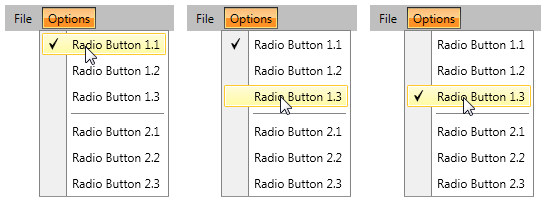

# Group Checkable Menu Items into Radio Group

This tutorial will show you how to group your checkable menu items into a radio group. This will allow you to have only one of them checked at a time.

## Creating a sample RadMenu and defining the Radio Groups

Here is a sample __RadMenu__ and one of its items has two radio groups. Notice that the __Tag__ property of the __RadMenuItem__ is used to store the name of the Radio Group. In this case the groups are named "1" and "2".        

<snippet id='radmenu-how-to-group-checkable-menu-items-into-radio-group-block_1-xaml' />

## Handling the ItemClick Event

The next step is to handle the __ItemClick__ event of the __RadMenu.__ It gets fired each time an item gets clicked __.__

<snippet id='radmenu-how-to-group-checkable-menu-items-into-radio-group-block_2-xaml' />

In the event handler you get the item that has been clicked and check if it is checkable or is placed in a group.

<snippet id='radmenu-how-to-group-checkable-menu-items-into-radio-group-block_3-cs' />
<snippet id='radmenu-how-to-group-checkable-menu-items-into-radio-group-block_3-vb' />

The next step is to get the sibling items of the clicked one, which are from the same group.

## Getting All Sibling Items from the same Group

In order the uncheck the other items from the same group, you have to get them first. Here is a method that takes as a parameter the clicked item and returns the sibling items which are from the same group.

<snippet id='radmenu-how-to-group-checkable-menu-items-into-radio-group-block_4-cs' />
<snippet id='radmenu-how-to-group-checkable-menu-items-into-radio-group-block_4-vb' />

First you get the parent item of the clicked one and then you iterate through its __Items__ collection. The Items collection doesn't hold the container itself, so you have to get the container of each item and check if it belongs to the same group as the clicked item. The matching containers are returned as __List__.       

## Checking only the Clicked Item

Now as the sibling items from the same group are available, the only things that's left is to unmark those of them which are different from the clicked one as unchecked.

<snippet id='radmenu-how-to-group-checkable-menu-items-into-radio-group-block_5-cs' />
<snippet id='radmenu-how-to-group-checkable-menu-items-into-radio-group-block_5-vb' />

## Using this Logic with Dynamic Data

>tip Before you continue, please, Take a look at the topic about [Binding to Dynamic Data]().          

>tip An entirely business object oriented approach about handling radio groups within dynamic data can be found in the [online demo](https://demos.telerik.com/silverlight/#Menu/CheckableMenuItems).          

When having __RadMenu__ with dynamic data in it, the logic remains the same, but you have to modify the data items a bit, so they can provide the needed information. You need your business object to expose several properties.        

* __Header__ - indicates header text of the item. It will be bound to the __Header__ property of the __RadMenuItem.__

* __IsCheckable__ - indicates whether the item is checkable. It will be bound to the __IsCheckable__ property of the __RadMenuItem.__

* __IsSeparator__ - indicates whether the item is a separator. It will be bound to the __IsSeparator__ property of the __RadMenuItem__.

* __RadioGroup__ - represents the radio group to which the item belongs. It will be bound to the __Tag__ property of the __RadMenuItem__.

* __SubMenuItems__ - represents a collection with the sub menu items of the item. It will be bound to the __ItemsSource__ property of the __RadMenuItem__.

<snippet id='radmenu-how-to-group-checkable-menu-items-into-radio-group-block_6-cs' />
<snippet id='radmenu-how-to-group-checkable-menu-items-into-radio-group-block_6-vb' />

These properties should be bound in the __Style__ for the __RadMenuItem__ container to its respective properties:

<snippet id='radmenu-how-to-group-checkable-menu-items-into-radio-group-block_7-xaml' />

Next step will be to initialize the collection with the MenuItem objects which will be bound to __ItemsSource__ property of the __RadMenu.__

The ViewModel should look as shown below:        

<snippet id='radmenu-how-to-group-checkable-menu-items-into-radio-group-block_8-cs' />
<snippet id='radmenu-how-to-group-checkable-menu-items-into-radio-group-block_8-vb' />

Finally you need to set the created style to the __ItemContainerStyle__ property and bind the collection to the __ItemsSource__ property of the __RadMenu__.      

<snippet id='radmenu-how-to-group-checkable-menu-items-into-radio-group-block_9-xaml' />

From here on, the things work the same as in the scenario with the static items.

This will be the result:

## See Also

 * [Checkable Items]()

 * [Visual Structure]()

 * [Using Static Items]()

 * [Binding to Dynamic Data]()