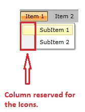
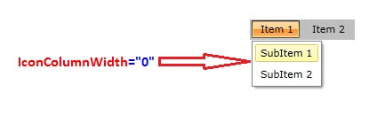
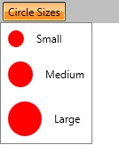

# How to Remove and Modify the Icon Area for RadMenu

This article shows how to remove the Icon area and also how to modify it in order to fit different sized Icons.

## How to Remove the Menu Icon

By default each __MenuItem__ has reserved space for an icon:



Since Q2 2010 __RadMenu__ has a property for defining the width of the column, which is reserved for the Icons. The property is called __IconColumnWidth__. When you set this property to 0 the space for the icons disappears.



## Set Different Icon Area Width for Each MenuItem

By default all of the MenuItems have equal space reserved for an icon. You can control the width of each MenuItem icon area by using the items' __IconColumnWidth__ property.

__Example 1: Modify MenuItem Icon Area Width__
```XAML
	<Window.Resources>
		<DataTemplate x:Key="IconTemplate">
			<Image Source="/Images/Circle.png" Stretch="UniformToFill" />
		</DataTemplate>
    </Window.Resources>
	<telerik:RadMenu VerticalAlignment="Top" IconColumnWidth="60">
	    <telerik:RadMenuItem Header="Circle Sizes" x:Name="sizeRadMenu" IconColumnWidth="0">
	        <telerik:RadMenuItem Header="Small" IconTemplate="{StaticResource IconTemplate}" IconColumnWidth="35" Height="35" />
	        <telerik:RadMenuItem Header="Medium" IconTemplate="{StaticResource IconTemplate}" IconColumnWidth="45" Height="45" />
	        <telerik:RadMenuItem Header="Large" IconTemplate="{StaticResource IconTemplate}" IconColumnWidth="55" Height="55" />
	    </telerik:RadMenuItem>
	</telerik:RadMenu>
```



## See Also

 * [Getting Started]()
 * [Icons]()
 * [Overview]()
