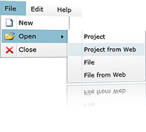

# Overview

## 






Thank you for choosing Telerik __RadMenu__!        

Telerik SilverlightWPF __RadMenu__ is not just another dropdown-list control. This control has a number of advanced features like hierarchical data binding, different opening modes, integration with commands and different type of items, as well as full layout and appearance customization capabilities.        

__RadMenu__ provides the power to build the entire navigation of your web application. Combining the ability to display hierarchical views and the advanced styling mechanism, __RadMenu__ lets you build even the most complicated site-menu systems.

This is a list with short descriptions of the top-of-the-line features of Telerik's __RadMenu__ control:        

* __Hierarchical Data Binding__ - the __RadMenu__ control allows you to bind and visualize sets of hierarchical data. You can also populate it by consuming data from XML files, WCF services, RIA services etc. [Read more]()

* __Opening Modes__ - let the child menu groups open only upon clicking a first-level item, thus achieving the behavior of windows-like menus. [Read more]()

* __Orientation__ - set the orientation to either horizontal or vertical by changing a single property. [Read more]()

* __Check/Uncheck items__ - let the users check/uncheck items and manage the collection of the checked items. Using the corresponding events you can entirely handle the check/uncheck action. [Read more]()

* __Commands__ - the __RadMenu__ control allows you to integrate its menu items with commands and pass parameters to them. [Read more]()

* __Appearance customizations -__ the __RadMenu__ control allows you to manipulate its default appearance by applying styles to it or by modifying its templates. You can modify the items depending on their type, thanks to the several properties that are exposed. [Read more]()


* __Boundary Detection__ - Telerik __RadMenu__ detects the Silverlight plug-in boundaries and opens its child item-groups in the opposite direction when the screen boundaries are to be crossed. When there is not enough space in both directions, the control will adjust its items’ position in order to make them visible whenever possible. [Read more]()


* __WPF/Silverlight Code Compatibility__ - The WPF Menu shares a single codebase with its Silverlight counterpart. This means that you can achieve close to 100% code reuse for your Menu logic if you have parallel WPF/Silverlight development.          

* __Codeless Test Automation__ - now you can record, execute and debug functional tests without leaving the familiar Visual Studio environment. Telerik [WebUI Test Studio](http://www.telerik.com/products/web-testing-tools/webui-test-studio-features.aspx) an advanced click and play web application testing tool specialized for automating both AJAX and Silverlight applications. The Studio ships with special translators for Telerik RadControls for ASP.NET AJAX and Silverlight. 

		
In this video, we will look at some of the features and functionality in Telerik RadMenu for Silverlight and how you can start using it in your rich internet applications today.(Runtime: 03:02)



# See Also

 * [Visual Structure]()

 * [Getting Started]()

 * [Styles and Templates]()

 * [Events]()

 * [Populating with Data]()
