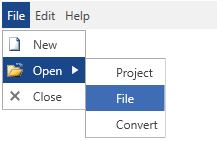

# Overview








Thank you for choosing Telerik __RadMenu__!        

Telerik __RadMenu__ for {{ site.framework_name }} provides the power to build the entire navigation of your web application. Combining the ability to display hierarchical views and the advanced styling mechanism, RadMenu lets you build even the most complicated site-menu systems. The control provides a number of advanced features like hierarchical data binding, different opening modes, integration with commands and different type of items, as well as full layout and appearance customization capabilities.        

## Key Features

This is a list with short descriptions of the top-of-the-line features of the RadMenu control.

* __Hierarchical data binding__: RadMenu allows you to bind and visualize sets of hierarchical data. You can also populate it by consuming data from XML files, WCF services, RIA services etc. Read more about this in the [Populating with Data]() section.

* __Icons__: The menu items expose an Icon property that can be used to define an icon are another custom UI element display at the left side of the item. Read more about this in the [Icons]() article.

* __Opening modes__: You to open the menu by click or mouse over. Read more about this in the [Opening Modes]() article.

* __Orientation__: You can set the orientation of the items to either horizontal or vertical by changing a single property. Read more about this in the [Orientation]() article.

* __Check/uncheck items__: RadMenu allows you to check/uncheck items and manage the collection of the checked items. Using the corresponding events you can entirely handle the check/uncheck action. Read more about this in the [Checkable Items]() article.

* __Commands support__: The control support commands, thus allowing you to integrate its menu items with commands and pass parameters to them. Read more about this in the [Keyboard Navigation]() article.

* __Keyboard navigation__: You can easily navigate through the items via the arrow keys on the keyboard. Read more about this in the [Commands]() article.


* __Boundary Detection__: Telerik RadMenu detects the Silverlight plug-in boundaries and opens its child item-groups in the opposite direction when the screen boundaries are to be crossed. When there is not enough space in both directions, the control will adjust its items’ position in order to make them visible whenever possible. [Read more]()


>tip Get started with the control with its [Getting Started]() help article that shows how to use it in a basic scenario.

> Check out the control's demos at [demos.telerik.com](http://demos.telerik.com/silverlight/#Menu)[demos.telerik.com](http://demos.telerik.com/wpf/)

## See Also
 * [Visual Structure]()
 * [Events]()
 * [Developer Focused Examples]()
