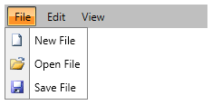

# Binding to Dynamic Data

The data displayed in the __RadMenu__ has a hierarchical structure (similar to the __RadTreeView__). This means that each item may come with a set of items on its own. For that reason you have to use the __HierarchicalDataTemplate__. This tutorial will walk you through the most important steps in creating, configuring and applying a __HierarchicalDataTemplate__ to your __RadMenu__, as follows:      

* [Preparing the data](#preparing-the-data)

* [Creating and Applying ItemContainerStyle](#creating-and-applying-the-itemcontainerstyle)

## Preparing the Data

For this tutorial the following sample class will be used:

__Example 1: MenuItem sample class__

```C#
	public class MenuItem
	{
	    public MenuItem()
	    {
	        this.SubItems = new ObservableCollection<MenuItem>();
	    }
	    public string Text
	    {
	        get;
	        set;
	    }
	    public Uri IconUrl
	    {
	        get;
	        set;
	    }
	    public ObservableCollection<MenuItem> SubItems
	    {
	        get;
	        set;
	    }
	}
```

__Example 1: MenuItem sample class__

```VB
	Public Class MenuItem
	    Public Sub New(text As String, iconUrl As Uri, subItems As ObservableCollection(Of MenuItem))
	        Me.Text = text
	        Me.IconUrl = iconUrl
	        Me.SubItems = subItems
	    End Sub
	    Public Property Text() As String
	        Get
	        End Get
	        Set(value As String)
	        End Set
	    End Property
	    Public Property IconUrl() As Uri
	        Get
	        End Get
	        Set(value As Uri)
	        End Set
	    End Property
	    Public Property SubItems() As ObservableCollection(Of MenuItem)
	        Get
	        End Get
	        Set(value As ObservableCollection(Of MenuItem))
	        End Set
	    End Property
	End Class
```

The __MenuItem__ class holds the information for the menu items.

* __Text__ - represents the text value for the item.

* __IconUrl__ - represents the url of the image that represents the icon of the menu item.

* __SubItems__ - a collection of the sub menu items of the current menu item.

On the next step a sample method, which creates the sample data, is needed. Here is one:

__Example 2: Creating MenuItems collection__

```C#
	public ObservableCollection<MenuItem> GetMenuItems()
	{
	    ObservableCollection<MenuItem> items = new ObservableCollection<MenuItem>();
	    ObservableCollection<MenuItem> fileSubItems = new ObservableCollection<MenuItem>();
	    MenuItem newItem = new MenuItem()
	    {
	        IconUrl = new Uri("/Images/newFile.png", UriKind.Relative),
	        Text = "New File"
	    };
	    fileSubItems.Add(newItem);
	    MenuItem openItem = new MenuItem()
	    {
	        IconUrl = new Uri("/Images/open.png", UriKind.Relative),
	        Text = "Open File"
	    };
	    fileSubItems.Add(openItem);
	    MenuItem saveItem = new MenuItem()
	    {
	        IconUrl = new Uri("/Images/save.png", UriKind.Relative),
	        Text = "Save File"
	    };
	    fileSubItems.Add(saveItem);
	    MenuItem fileItem = new MenuItem()
	    {
	        SubItems = fileSubItems,
	        Text = "File"
	    };
	    items.Add(fileItem);
	    MenuItem editItem = new MenuItem()
	    {
	        Text = "Edit"
	    };
	    items.Add(editItem);
	    MenuItem viewItem = new MenuItem()
	    {
	        Text = "View"
	    };
	    items.Add(viewItem);
	    return items;
	}
```

__Example 2: Creating MenuItems collection__

```VB
	Public Function GetMenuItems() As ObservableCollection(Of MenuItem)
	    Dim items As New ObservableCollection(Of MenuItem)()
	    Dim fileSubItems As New ObservableCollection(Of MenuItem)()
	    Dim newItem As New MenuItem("New File", New Uri("/Images/newFile.png", UriKind.Relative), Nothing)
	    fileSubItems.Add(newItem)
	    Dim openItem As New MenuItem("Open File", New Uri("/Images/open.png", UriKind.Relative), Nothing)
	    fileSubItems.Add(openItem)
	    Dim saveItem As New MenuItem("Save", New Uri("/Images/save.png", UriKind.Relative), Nothing)
	    fileSubItems.Add(saveItem)
	    Dim fileItem As New MenuItem("File", Nothing, fileSubItems)
	    items.Add(fileItem)
	    Dim editItem As New MenuItem("Edit", Nothing, Nothing)
	    items.Add(editItem)
	    Dim viewItem As New MenuItem("View", Nothing, Nothing)
	    items.Add(viewItem)
	    Return items
	End Function
```

Finally, pass the generated collection to the __ItemsSource__ of the __RadMenu__.

__Example 3: Setting the ItemsSource of the Menu__

```C#
	public Default_Cs()
	{
	    InitializeComponent();
	    this.radMenu.ItemsSource = this.GetMenuItems();
	}
```

__Example 3: Setting the ItemsSource of the Menu__

```VB
	Public Sub New()
	    InitializeComponent()
	    Me.radMenu.ItemsSource = Me.GetMenuItems()
	End Sub
```

## Creating and Applying the ItemContainerStyle

In order to visualize the data in __RadMenu__ you can use *ItemContainerStyle* property. When used in combination with *ItemsSource*, the Style is applied on all __RadMenuItems__. The only thing you have to do is set the bindings for the needed properties. For the "Icon" you will have to use "IconTemplate" as shown below. When you bind the "Icon" property to the "IconUrl", its value will be passed to the DataTemplate and used as a Source of an image.        

__Example 4: Defining MenuItemStyle__

```XAML
	<Style x:Key="MenuItemStyle" TargetType="telerik:RadMenuItem">
	    <Setter Property="Header" Value="{Binding Text}"/>
	    <Setter Property="ItemsSource" Value="{Binding SubItems}"/>
	    <Setter Property="Icon" Value="{Binding IconUrl}" />
	    <Setter Property="IconTemplate" >
	        <Setter.Value>
	            <DataTemplate>
	                <Image Source="{Binding}" Stretch="UniformToFill"/>
	            </DataTemplate>
	        </Setter.Value>
	    </Setter>
	</Style>
```

>If you're using [Implicit Styles]() note that the Style that targets RadMenuItem should be based on the default __RadMenuItemStyle__.

So it's time to define __RadMenu__ and set "ItemContainerStyle" property:
        
__Example 5: Applying the MenuItemStyle to RadMenu__

```XAML
	<telerik:RadMenu x:Name="radMenu" ItemContainerStyle="{StaticResource MenuItemStyle}"/>
```

__Figure 1__ illustrates the final result.

#### __Figure 1: RadMenu bound to dynamic data__


## See Also

 * [Populating with Data - Overview]()

 * [Data Binding Support Overview]()

 * [Using Static Items]()

 * [Template and Style Selectors]()

 * [Group Checkable Menu Items into Radio Group]()
