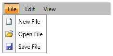

# Binding to Dynamic Data

The data displayed in the __RadMenu__ has a hierarchical structure (similar to the __RadTreeView__). This means that each item may come with a set of items on its own. For that reason you have to use the __HierarchicalDataTemplate__. This tutorial will walk you through the most important steps in creating, configuring and applying a __HierarchicalDataTemplate__ to your __RadMenu__, as follows:      

* [Preparing the data](#preparing-the-data)

* [Creating and Applying ItemContainerStyle](#creating-and-applying-the-itemcontainerstyle)

## Preparing the Data

For this tutorial the following sample class will be used:

__Example 1: MenuItem sample class__

<snippet id='radmenu-populating-with-data-binding-to-dynamic-data-block_1-cs' />

__Example 1: MenuItem sample class__

<snippet id='radmenu-populating-with-data-binding-to-dynamic-data-block_2-vb' />

The __MenuItem__ class holds the information for the menu items.

* __Text__ - represents the text value for the item.

* __IconUrl__ - represents the url of the image that represents the icon of the menu item.

* __SubItems__ - a collection of the sub menu items of the current menu item.

On the next step a sample method, which creates the sample data, is needed. Here is one:

__Example 2: Creating MenuItems collection__

<snippet id='radmenu-populating-with-data-binding-to-dynamic-data-block_3-cs' />

__Example 2: Creating MenuItems collection__

<snippet id='radmenu-populating-with-data-binding-to-dynamic-data-block_4-vb' />

Finally, pass the generated collection to the __ItemsSource__ of the __RadMenu__.

__Example 3: Setting the ItemsSource of the Menu__

<snippet id='radmenu-populating-with-data-binding-to-dynamic-data-block_5-cs' />

__Example 3: Setting the ItemsSource of the Menu__

<snippet id='radmenu-populating-with-data-binding-to-dynamic-data-block_6-vb' />

## Creating and Applying the ItemContainerStyle

In order to visualize the data in __RadMenu__ you can use *ItemContainerStyle* property. When used in combination with *ItemsSource*, the Style is applied on all __RadMenuItems__. The only thing you have to do is set the bindings for the needed properties. For the "Icon" you will have to use "IconTemplate" as shown below. When you bind the "Icon" property to the "IconUrl", its value will be passed to the DataTemplate and used as a Source of an image.        

__Example 4: Defining MenuItemStyle__

<snippet id='radmenu-populating-with-data-binding-to-dynamic-data-block_7-xaml' />

>If you're using [Implicit Styles]() note that the Style that targets RadMenuItem should be based on the default __RadMenuItemStyle__.

So it's time to define __RadMenu__ and set "ItemContainerStyle" property:
        
__Example 5: Applying the MenuItemStyle to RadMenu__

<snippet id='radmenu-populating-with-data-binding-to-dynamic-data-block_8-xaml' />

__Figure 1__ illustrates the final result.

#### __Figure 1: RadMenu bound to dynamic data__

## See Also

 * [Populating with Data - Overview]()

 * [Data Binding Support Overview]()

 * [Using Static Items]()

 * [Template and Style Selectors]()

 * [Group Checkable Menu Items into Radio Group]()