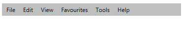
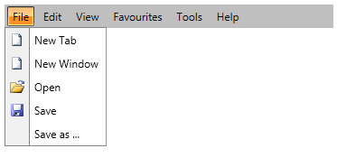

# Using Static Items

This tutorial will walk you through the common task of populating __RadMenu__ with __RadMenuItems__ declaratively. 

__Example 1__ shows a regular __RadMenu__ declaration without items.

__Example 1: RadMenu declaration__

```XAML
	<telerik:RadMenu VerticalAlignment="Top">
```

In order to add items you need to use the __RadMenu's Items__ property. The __Items__ property is an __ItemCollection__ which contains your __RadMenuItems__. For example, the following lines will add the top-level items of the menu.

__Example 2: RadMenu with static top-level items__

```XAML
	<telerik:RadMenu VerticalAlignment="Top">
	    <telerik:RadMenuItem Header="File" />
	    <telerik:RadMenuItem Header="Edit" />
	    <telerik:RadMenuItem Header="View" />
	    <telerik:RadMenuItem Header="Favourites" />
	    <telerik:RadMenuItem Header="Tools" />
	    <telerik:RadMenuItem Header="Help" />
	</telerik:RadMenu>
```

#### __Figure 1: RadMenu with static top-level items__



Each of the __RadMenuItems__ can have child items that are defined in the same way. __Example 3__ illustrates how to add submenu items to one of the top-level items.

__Example 3: Adding static submenu items__

```XAML
	<telerik:RadMenu VerticalAlignment="Top">
	    <telerik:RadMenuItem Header="File">
	        <telerik:RadMenuItem Header="New Tab">
	            <telerik:RadMenuItem.Icon>
	                <Image Source="/Images/newFile.png" Stretch="None" />
	            </telerik:RadMenuItem.Icon>
	        </telerik:RadMenuItem>
	        <telerik:RadMenuItem Header="New Window">
	            <telerik:RadMenuItem.Icon>
	                <Image Source="/Images/newFile.png" Stretch="None" />
	            </telerik:RadMenuItem.Icon>
	        </telerik:RadMenuItem>
	        <telerik:RadMenuItem Header="Open">
	            <telerik:RadMenuItem.Icon>
	                <Image Source="/Images/open.png" Stretch="None" />
	            </telerik:RadMenuItem.Icon>
	        </telerik:RadMenuItem>
	        <telerik:RadMenuItem Header="Save">
	            <telerik:RadMenuItem.Icon>
	                <Image Source="/Images/save.png" Stretch="None" />
	            </telerik:RadMenuItem.Icon>
	        </telerik:RadMenuItem>
	        <telerik:RadMenuItem Header="Save as ..." />
	    </telerik:RadMenuItem>
	    <telerik:RadMenuItem Header="Edit" />
	    <telerik:RadMenuItem Header="View" />
	    <telerik:RadMenuItem Header="Favourites" />
	    <telerik:RadMenuItem Header="Tools" />
	    <telerik:RadMenuItem Header="Help" />
	</telerik:RadMenu>
```

#### __Figure 2: RadMenu with static submenu items__


The submenu items can also have children on their own.

## See Also

 * [Populating with Data - Overview]()

 * [Data Binding Support Overview]()

 * [Binding to Dynamic Data]()
